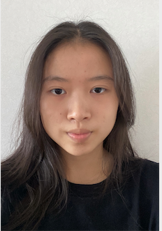
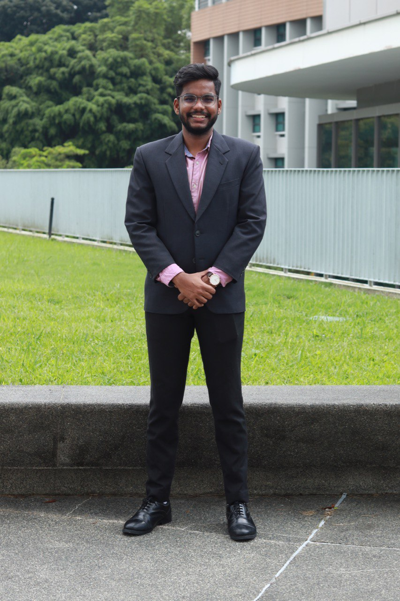

We are a team based in the [School of Computing, National University of Singapore](http://www.comp.nus.edu.sg).

You can reach us at the email `mahidharah@gmail.com`

## Project team T09-02

### C Mahidharah Rajendran

[[homepage](http://www.comp.nus.edu.sg/~damithch)]
[[github](https://github.com/Mahidharah)]
[[Linkedin](https://www.linkedin.com/in/mahidharah/)]

* Role: Developer

### Elizabeth Mao Zhi Min

[[github](http://github.com/emzm2023)]
[[portfolio](team/emzm2023.md)]

### Wan Mingyu

[[github](http://github.com/mingyu-wan)]
[[portfolio](team/mingyu-wan.md)]

* Role: Developer

### Mathan Chidambaranathan

[[github](http://github.com/ncmathan)]
[[portfolio](team/ncmathan.md)]

* Role: Developer

### Mohammed Waseem Malik

[[github](http://github.com/waseemingly)] [[portfolio](team/waseemingly.md)]

* Role: Developer
* Responsibilities: Deliverables and deadlines

