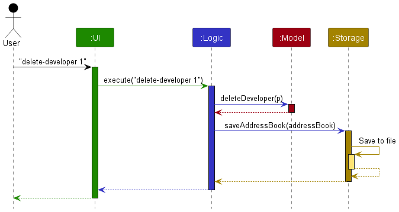
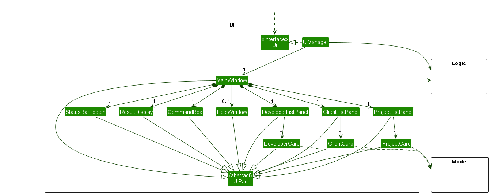
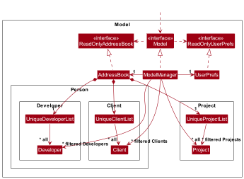
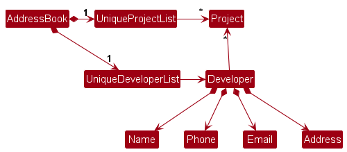
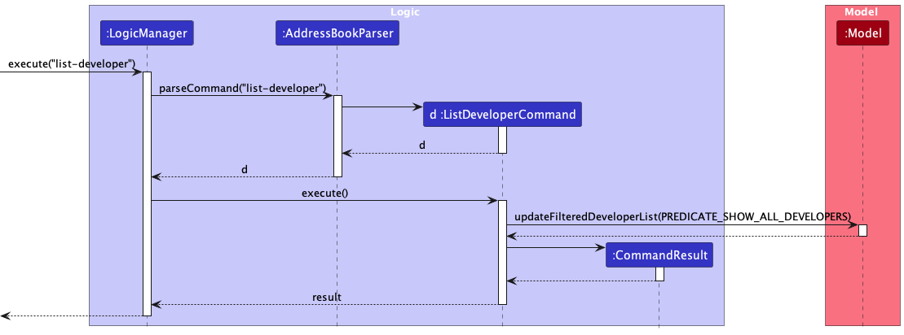
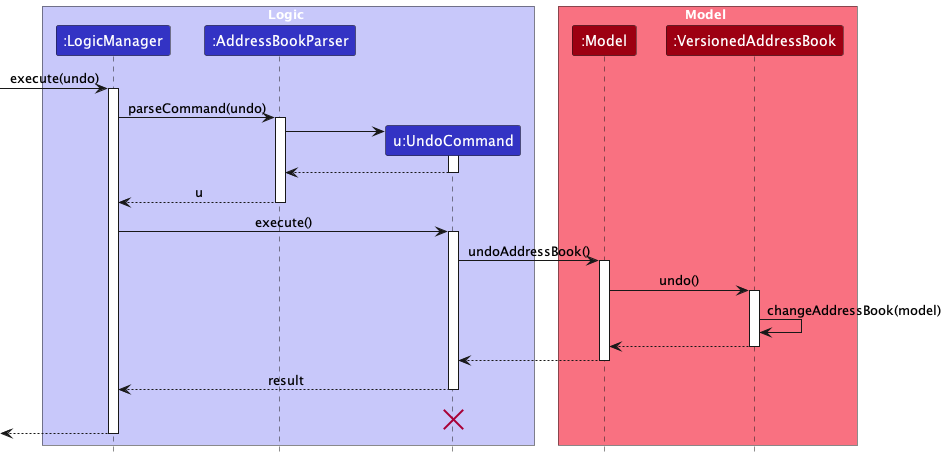
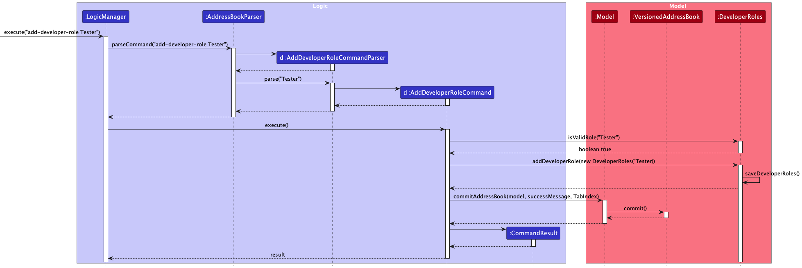
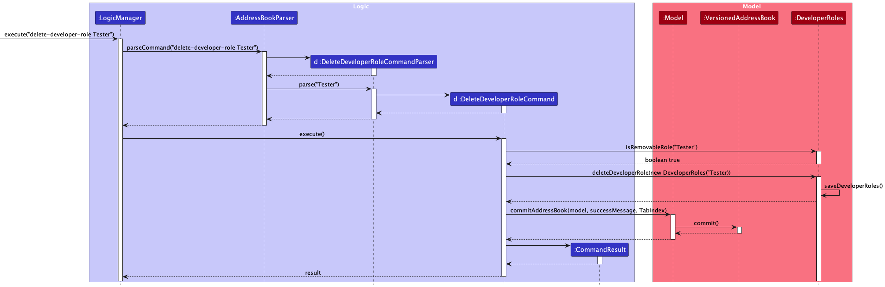
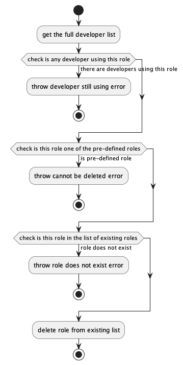
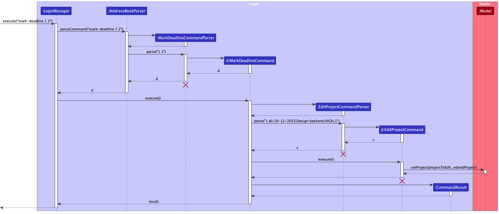

## Table of Contents
* [Acknowledgements](#acknowledgements)
* [Setting up and getting started](#setting-up-and-getting-started)
* [Design](#design)
  * [Architecture](#architecture)
  * [UI Component](#ui-component)
  * [Logic Component](#logic-component)
  * [Model Component](#model-component)
  * [Storage component](#storage-component)
  * [Common Classes](#common-classes)
* [Implementation](#implementation)
* [Documentation, logging, testing, configuration, dev-ops](#documentation-logging-testing-configuration-dev-ops)
* [Appendix: Requirements](#appendix-requirements)
  * [Product Scope](#project-scope)
  * [User Stories](#user-stories)
  * [Use Cases](#use-cases)
  * [Non Functional Requirements](#non-functional-requirements)
  * [Glossary]
* [Appendix: Manual Testing](#appendix-manual-testing)
* [Appendix: Planned Enhancements](#appendix-planned-enhancement)
* [Appendix: Effort](#appendix-effort)

--------------------------------------------------------------------------------------------------------------------

## **Acknowledgements**
* Adapted from [AB3](https://se-education.org/addressbook-level3/)
* {list here sources of all reused/adapted ideas, code, documentation, and third-party libraries -- include links to the original source as well}

--------------------------------------------------------------------------------------------------------------------

## **Setting up and getting started**

* Refer to the guide [Setting up and getting started](https://ay2324s1-cs2103t-t09-2.github.io/tp/SettingUp.html).

--------------------------------------------------------------------------------------------------------------------
## **Design**

:bulb: **Tip:** The `.puml` files used to create diagrams in this document `docs/diagrams` folder. Refer to the [_PlantUML Tutorial_ at se-edu/guides](https://se-education.org/guides/tutorials/plantUml.html) to learn how to create and edit diagrams.

### Architecture

The **Architecture Diagram** given above explains the high-level design of the App.

Given below is a quick overview of main components and how they interact with ea

**Main components of the architecture**

**`Main`** (consisting of classes [`Main`](https://github.com/se-edu/addressbook-level3/tree/master/src/main/java/seedu/address/Main.java) and [`MainApp`](https://github.com/se-edu/addressbook-level3/tree/master/src/main/java/seedu/address/MainApp.java)) is in charge of the app launch and shut down.
* At app launch, it initializes the other components in the correct sequence, and connects them up with each other.
* At shut down, it shuts down the other components and invokes cleanup methods where necessary.
* The bulk of the app's work is done by the following four components:
    * [**`UI`**](#ui-component): The UI of the App.
    * [**`Logic`**](#logic-component): The command executor.
    * [**`Model`**](#model-component): Holds the data of the App in memory.
    * [**`Storage`**](#storage-component): Reads data from, and writes data to, the hard disk.

[**`Commons`**](#common-classes) represents a collection of classes used by multiple other components.

**How the architecture components interact with each other**

The *Sequence Diagram* below shows how the components interact with each other for the scenario where the user issues the command `delete 1`.

Each of the four main components (also shown in the diagram above),

* defines its *API* in an `interface` with the same name as the Component.
* implements its functionality using a concrete `{Component Name}Manager` class (which follows the corresponding API `interface` mentioned in the previous point).

For example, the `Logic` component defines its API in the `Logic.java` interface and implements its functionality using the `LogicManager.java` class which follows the `Logic` interface. Other components interact with a given component through its interface rather than the concrete class (reason: to prevent outside component's being coupled to the implementation of a component), as illustrated in the (partial) class diagram below.

The sections below give more details of each component.

### UI component

The **API** of this component is specified in [`Ui.java`](https://github.com/se-edu/addressbook-level3/tree/master/src/main/java/seedu/address/ui/Ui.java)

The UI consists of a `MainWindow` that is made up of parts e.g.`CommandBox`, `ResultDisplay`, `PersonListPanel`, `StatusBarFooter` etc. All these, including the `MainWindow`, inherit from the abstract `UiPart` class which captures the commonalities between classes that represent parts of the visible GUI.

The `UI` component uses the JavaFx UI framework. The layout of these UI parts are defined in matching `.fxml` files that are in the `src/main/resources/view` folder. For example, the layout of the [`MainWindow`](https://github.com/se-edu/addressbook-level3/tree/master/src/main/java/seedu/address/ui/MainWindow.java) is specified in [`MainWindow.fxml`](https://github.com/se-edu/addressbook-level3/tree/master/src/main/resources/view/MainWindow.fxml)

The `UI` component,
The UI component,
* executes user commands using the Logic component.
* listens for changes to Model data so that the UI can be updated with the modified data.
* keeps a reference to the Logic component, because the UI relies on the Logic to execute commands.
* depends on some classes in the Model component, as it displays Person object residing in the Model.

### Logic component

**API** : [`Logic.java`](https://github.com/se-edu/addressbook-level3/tree/master/src/main/java/seedu/address/logic/Logic.java)

Here's a (partial) class diagram of the `Logic` component:

The sequence diagram below illustrates the interactions within the `Logic` component, taking `execute("delete 1")` API call as an example.

:information_source: **Note:** The lifeline for `DeleteCommandParser` should end at the destroy marker (X) but due to a limitation of PlantUML, the lifeline reaches the end of diagram.

How the `Logic` component works:

1. When `Logic` is called upon to execute a command, it is passed to an `AddressBookParser` object which in turn creates a parser that matches the command (e.g., `DeleteCommandParser`) and uses it to parse the command.
2. This results in a `Command` object (more precisely, an object of one of its subclasses e.g., `DeleteCommand`) which is executed by the `LogicManager`.
3. The command can communicate with the `Model` when it is executed (e.g. to delete a developer).
4. The result of the command execution is encapsulated as a `CommandResult` object which is returned back from `Logic`.

Here are the other classes in `Logic` (omitted from the class diagram above) that are used for parsing a user command:

How the parsing works:
* When called upon to parse a user command, the `AddressBookParser` class creates an `XYZCommandParser` (`XYZ` is a placeholder for the specific command name e.g., `AddCommandParser`) which uses the other classes shown above to parse the user command and create a `XYZCommand` object (e.g., `AddCommand`) which the `AddressBookParser` returns back as a `Command` object.
* All `XYZCommandParser` classes (e.g., `AddCommandParser`, `DeleteCommandParser`, ...) inherit from the `Parser` interface so that they can be treated similarly where possible e.g, during testing.

### Model component
**API** : [`Model.java`](https://github.com/se-edu/addressbook-level3/tree/master/src/main/java/seedu/address/model/Model.java)

The `Model` component,

* stores the address book data i.e., all `Developer` objects (which are contained in a `UniqueDeveloperList` object), and similarly so for `Client` and `Project` objects.
* stores the currently 'selected' `Developer` objects (e.g., results of a search query) as a separate _filtered_ list which is exposed to outsiders as an unmodifiable `ObservableList<Developer>` that can be 'observed' e.g. the UI can be bound to this list so that the UI automatically updates when the data in the list change. This is similar for `Client` and `Project` objects.
* stores a `UserPref` object that represents the user’s preferences. This is exposed to the outside as a `ReadOnlyUserPref` objects.
* does not depend on any of the other three components (as the `Model` represents data entities of the domain, they should make sense on their own without depending on other components)

:information_source: **Note:** An alternative (arguably, a more OOP) model is given below. It has a `Tag` list in the `AddressBook`, which `Person` references. This allows `AddressBook` to only require one `Tag` object per unique tag, instead of each `Person` needing their own `Tag` objects. 

### Storage component

**API** : [`Storage.java`](https://github.com/se-edu/addressbook-level3/tree/master/src/main/java/seedu/address/storage/Storage.java)

The `Storage` component,
* can save both address book data and user preference data in JSON format, and read them back into corresponding objects.
* inherits from both `AddressBookStorage` and `UserPrefStorage`, which means it can be treated as either one (if only the functionality of only one is needed).
* depends on some classes in the `Model` component (because the `Storage` component's job is to save/retrieve objects that belong to the `Model`)

### Common classes

Classes used by multiple components are in the `seedu.address.commons` package.

This section describes some noteworthy details on how certain features are implemented.

--------------------------------------------------------------------------------------------------------------------
## Implementation
### Add features
Upon entry of the add developer command, an `AddDeveloperCommand` class is created. The `AddDeveloperCommand` class extends the abstract `Command` class and implements the `execute()` method. Upon execution of this method, a `Developer` object is added to the model’s list of developers if all the attributes provided are valid and a duplicate instance does not exist.

Given below is an example usage scenario of how the add developer is executed step by step.

The following sequence diagram illustrates how the add developer operation works
#### Implementation
#### Design considerations

### Delete features
Deletes a developer at the specified **one-based index** of list of currently existing/found developers. Users are able to delete any developer in the list. If an index larger than or equal to the size of the developer’s list is provided, the command will not be allowed and an error will be thrown to alert user.

Example Use: `del-d 1`
#### Implementation
Upon entry of the delete developer command, a `DeleteDeveloperCommand` class is created. The `DeleteDeveloperCommand` class extends the abstract `Command` class and implements the `execute()` method. Upon execution of this method, the doctor at specified **one-based index** is removed if the index provided is valid.

Given below is an example usage scenario of how the delete developer command behaves at each step.
Step 2. User executes `del-d 1` to delete the developer at index 1 (one-based in
Step 3. The developer at this index is removed if the index provided is valid.

The following sequence diagram illustrates how the delete developer operation works:
#### Design considerations

### Import feature
This feature will allow project managers to import existing spreadsheets of developer and client data in the specified format in CSV
#### Implementation

There are 2 implementations: CLI and GUI

##### CLI Implementation
Upon entry of the import developer command, an `ImportDeveloperCommand` class is created. The `ImportDeveloperCommand` class extends the abstract `Command` class and implements the `execute()` method. Upon execution of this method, a list of `Developer` objects are added to the model’s list of developers if all the attributes provided are valid and a duplicate instance does not exist.

Given below is an example usage scenario of how the import developer is executed step by step.

Step 1. User launches the application

Step 2. User inputs `import-developer developers.csv` to indicate path and filename of where the spreadsheet of developers is located.

Step 3. The developers are added to the model’s list of developers if valid the column names are valid and each row of input is valid.

The implementation follows likewise for clients.

The following sequence diagram illustrates how the add developer operation works:

##### GUI Implementation
A new menu item will be added under File called `Import developers` and `Import clients`

Clicking it will lead to a window to select the location of the respective file in csv format.

The backend implementation of logic follows the CLI implementation by creating a `ImportDeveloperCommand` or `ImportClientCommand`

### Edit features
#### Implementation
The original edit feature from AB-3 has been extended to account for the editing of projects and specific people - developers
and clients. The edit command will be parsed to return 1 of 3 different commands, depending on the
object to be edited.

The `AddressBookParser` will return the respective parser for the command depending on the user input in accordance to the
respective command words defined in `CliSyntax`. Namely,
* `edit-developer` will return an `EditDeveloperCommandParser` that parses the user input and creates an `EditDeveloperCommand`
* `edit-client` will return an `EditClientCommandParser` that parses the user input and creates an `EditClientCommand`
* `edit-project` will return an `EditProjectCommandParser` that parses the user input and creates an `EditProjectCommand`

Each instance of `EditDeveloperCommand`, `EditClientCommand`, and `EditProjectCommand` objects have 2 private fields:
1. an instance of `Index` containing the index of the target object to edit in the currently displayed list, and
2. an instance of `EditDeveloperDescriptor`, `EditClientDescriptor`, or `EditProjectDescriptor` respectively, which
contains the edited fields to update the target object with.

Executing the command will replace the existing object in the current `model` with the new object with the edited fields.

Other than extending the commands, parsers, and descriptors to account for `Developer`, `Client`, and `Project` separately,
some changes to the sequence of interactions between the `Logic` and `Model` components were also made. When
`EditDeveloperCommand` and `EditClientCommand` is executed with edits made to a `Project` assigned to a `Developer` or
`Client`, it calls `Model#areProjectsValid()` to check whether there is an existing `Project` with that name.

Given below is an example usage scenario where the user edits the projects assigned to a `Developer` using the `edit-developer`
command.

**Step 1.** User launches the application and unlocks the application with the correct password.

**Step 2.** User executes an edit developer command by entering `edit-developer 1 pr/AppleApp` to edit the projects assigned
to the developer at index 1 (one-based indexing) in the currently displayed developer list.

**Step 3.** The developer at index 1 is edited to be assigned to the project `AppleApp` given that there is an existing
project with the name `AppleApp` in the address book.

The sequence diagram below illustrates key interactions taking place in the `Logic` component when the command
`edit-developer 1 pr/AppleApp` is called. A significant modification to take note off is the call to the
`Model#areProjectsValid()` method. This sequence reflects a successful command execution.

The `edit-client` and `edit-project` commands are executed similarly, except project validation checks using the
`Model#areProjectsValid()` method are not conducted for the latter.

#### Design considerations
**Aspect: Command syntax**
* Alternative 1 (current choice): Have separate commands for each `Developer`, `Client`, and `Project`. Executing the command
automatically switches user to the respective tab.
  * Pros: More specific and straightforward, allowed parameters in command are easier to navigate for users. More flexible
    as do not need to be in respective tab to edit.
  * Cons: More classes to create, user needs to type more.
* Alternative 2: Have one general `edit` command. The edit will be made based on the current tab displayed.
  * Pros: User as can be less specific when typing command.
  * Cons: User needs to ensure that intended tab is open. Allowed parameters are less clearly defined, can lead to
  confusion and mistakes.

### Find Features

#### Implementation

The find feature is facilitated by a map-based strategy, associating specific prefixes (e.g., "find-developer n/" or "find-client r/") with corresponding predicates, allowing dynamic generation of filtering criteria based on user input.

Implemented operations include:
- `FindCommandParser#parse()`: Interprets the user's input and generates the appropriate predicate to filter the list of developers or clients.
- `Model#updateFilteredPersonList()`: Updates the list displayed in the UI based on the provided predicate.

Given below is an example usage scenario and how the find mechanism behaves at each step:

**Step 1.** The user launches the application. The list of developers and clients are displayed.

**Step 2.** To filter developers by name, the user executes the command `find-developer n/ alice bob`. The application recognizes the "developer n/" prefix and uses the `NameContainsKeywordsPredicate` to generate a filtering criteria. The list in the UI is updated to only display developers named Alice or Bob.

**Step 3.** Next, the user wants to find clients from a specific organisation. They use the command `find-client o/Google`. The "find-client o/" prefix maps to the `OrganisationContainsKeywordsPredicate` and filters clients associated with Google.

**Step 4.** If the user provides an unrecognized prefix, e.g., `find-developer z/ alice`, an error message is displayed informing them of the correct command format.

> :information_source: **Note:** The following sequence diagram provides an overview of how the find operation is executed:

The following sequence diagram provides an overview of how the find operation is executed

**Aspect:** Implementation of the predicate map: 
**Alternative 1:**
- Use a long chain of `if-else` conditions for each attribute.
    - **Pros:** Explicit parsing logic for each attribute.
    - **Cons:** Code becomes lengthy and hard to maintain. Adding a new attribute involves modifying the parsing logic, increasing the risk of errors.

**Alternative 2 (current choice):**
- Use a map linking prefixes to their corresponding predicate constructors.
    - **Pros:** Simplifies the parsing process. Adding a new attribute to search becomes as simple as adding a new entry in the map.
    - **Cons:** A potential mismatch between the prefix and its predicate can lead to wrong results.

Given the benefits of a more maintainable and scalable codebase, we've decided to go with the first alternative. Future enhancements might include fuzzy search.

### List features

#### Implementation
The list command employs a structured approach where specific commands, such as `list-developer` or `list-client`
are associated with corresponding functionalities. This allows users to efficiently retrieve
information about developers, clients or projects by specifying the relevant prefix, streamlining the process of
generating targeted lists based on user input.

Implemented operations include:
* `<TYPE>` here refers to developer, client or project
* `AddressBookParser`: Interprets the user's input and calls the appropriate `List<TYPE>Command#execute()` to print the
relevant lists of data
* `Model#updateFiltered<TYPE>List`: Update the list displayed in the UI to print all the existing developers
,clients or projects.

Given below is an example usage scenario and how the `list` mechanism behaves at each step:

**Step 1.** The user used the `find` feature to search for something and the UI is only displaying some
developers

**Step 2.** To list all the developers, the user executes the command `list-developer`. `AddressBookParser`
recognizes the `list-developer` command and calls the `ListDeveloperCommand`.

**Step 3.** Next, the `ListDeveloperCommand#execute()` method that overides the abstract method `Command#execute()` gets
activated.This `execute()` method calls the `Model#updateFilteredDeveloperList`, passing in the `Predicate<Developer>`
that has been set to true.

**Step 4.** `Model#updateFilteredDeveloperList` then updates the list in the UI to print all the existing developers.

The following sequence diagram provides an overview of how the find operation is executed

### Undo/redo features

#### Implementation - undo

The proposed undo/redo mechanism is facilitated by `VersionedAddressBook`. It extends `AddressBook` with an undo/redo
history, stored internally as an `addressBookStateList` and `currentStatePointer`. Customised to the functions of CodeContact to
have a more helpful message and automatic tab switch, the history for messages and tabs are also stored internally as
`successfulCommandMessages` and `tabIndex`.
Additionally, it implements the following operations:

* `VersionedAddressBook#commit()` — Saves the current address book state in its history.
* `VersionedAddressBook#undo()` — Restores the previous address book state from its history.
* `VersionedAddressBook#redo()` — Restores a previously undone address book state from its history.

These operations are exposed in the `Model` interface as `Model#commitAddressBook()`, `Model#undoAddressBook()` and `Model#redoAddressBook()` respectively.

Given below is an example usage scenario and how the `undo`/`redo` mechanism behaves at each step.

**Step 1.** The user launches the application for the first time. The `VersionedAddressBook` will be initialized with the initial address book state, and the `currentStatePointer` pointing to that single address book state.

**Step 2.** The user executes `delete-developer 5` command to delete the 5th developer in the address book. The `delete`
command calls `Model#commitAddressBook()`, causing the modified state of the address book after the `delete-developer 5`
command executes to be saved in the `addressBookStateList`. The successful command message and tab it switched to
also saved into `successfulCommandMessages` and `tabIndex` respectively. The `currentStatePointer` is then shifted to the newly
inserted address book state.

**Step 3.** The user executes `add-developer n/David …​` to add a new developer. The `add` command also calls
`Model#commitAddressBook()`, causing another modified address book state to be saved into the `addressBookStateList`,
and another successful command message and tab switched saved into `successfulCommandMessages` and `tabIndex`.

:information_source: **Note:** If a command fails its execution, it will not call `Model#commitAddressBook()`, so the address book state will not be saved into the `addressBookStateList`.

**Step 4.** The user now decides that adding the developer was a mistake, and decides to undo that action by executing the `undo` command. The `undo` command will call `Model#undoAddressBook()`, which will shift the `currentStatePointer` once to the left, pointing it to the previous address book state, and restores the address book to that state.

The following sequence diagram shows how the undo operation works:

#### Implementation - redo
The `redo` command does the opposite — it calls `Model#redoAddressBook()`, which shifts the `currentStatePointer` once to the right, pointing to the previously undone state, and restores the address book to that state.

:information_source: **Note:** If the `currentStatePointer` is at index `addressBookStateList.size() - 1`, pointing to the latest address book state, then there are no undone AddressBook states to restore. The `redo` command uses `Model#canRedoAddressBook()` to check if this is the case. If so, it will return an error to the user rather than attempting to perform the redo.

**Step 5.** The user then decides to execute the command `list`. Commands that do not modify the address book, such as `list`, will usually not call `Model#commitAddressBook()`, `Model#undoAddressBook()` or `Model#redoAddressBook()`. Thus, the `addressBookStateList` remains unchanged.

**Aspect: How undo & redo executes:**

* **Alternative 1 (current choice):** Saves the entire address book.
  * Pros: Easy to implement.
  * Cons: May have performance issues in terms of memory usage.

* **Alternative 2 (part of current choice):** Individual command knows how to undo/redo by itself.
  * Pros: Will use less memory (e.g. for `delete`, just save the developer being deleted).
  * Cons: We must ensure that the implementation of each individual command are correct.
  * Due to a special parameter `role` having its own add and delete functions which are separated from the
    model and not stored in address book, it uses alternative 2 whereby `undo` an `add-developer-role` will just
    execute the `delete-developer-role function`. The process of this implementation had to be very careful just like
    what the cons mentioned, a slight validation error can change the whole `undo` and `redo` feature.

### Add roles feature
#### Implementation
The add role command employs a structured approach where specific commands, such as `add-developer-role` or
`add-client-role`are associated with corresponding functionalities. This allows users to efficiently add
information about developers and clients. One of the validation checks when adding a developer or client is that this role
added must exist. This is where users will need this command to add in the respective roles. This feature is facilitated
with the `DeveloperRoles` and `ClientRoles` class which implements the following operations:

* `DeveloperRoles#addDeveloperRole()`  —  Adds a developer role into the list of roles stored
* `DeveloperRoles#saveDeveloperRoles()`  —  Saves the updated list of developer roles
* `DeveloperRoles#loadDeveloperRoles()`  —  Loads the existing list of developer roles from file
* `DeveloperRoles#isValidRole()`  —  Checks if this role being added exists already

The classes are similar for `ClientRoles` but just that they are associated with the clients.

Given below is an example usage scenario and how the `add-developer-role` mechanism behaves at each step:

**Step 1.**  The user launches the application. The list roles for developers and clients are loaded into a list or roles.

**Step 2.**  The user executes the command `add-developer-role Tester`. The application recognizes the `add-developer-role`
and calls `AddDeveloperRoleCommandParser#parse()`.

**Step 3.** The parser checks if the argument is an empty blank space and trims the input given, in this case ` Tester` is
trimmed to `Tester` and calls `AddDeveloperRoleCommand`.

**Step 4.** `AddDeveloperRoleCommand#execute()` checks if there is an existing role with the same name and creates
a new developer role if there is no such role.

 
:exclamation: **Note:**
Although no changes is made to the address book, this stage is still committed so that the success command
message and tab index switched to can be changed, the currentPointer can also note that there is an action done here.

 
:exclamation: **Note:**
This is not a case-sensitive feature. The command allows users to add `developer` even if `Developer` exists. 

The following sequence diagram shows how the Add-role operation works:

**Aspect: How add-role executes:**
* **Alternative 1 (current choice):** Treat role as a variable, has a separate load and unload list
    * Pros: Role can just be treated as an attributed that needs more validation checks
    * Cons: Have to load and unload each time system relaunches, quite time and memory consuming

* **Alternative 2:** Treating role like another person or project, adding roles are like adding projects
    * Pros: Easy to implement.
    * Cons: Roles would have to be implemented on the same level as developers, clients and projects which should not be case.

### Delete roles feature
#### Implementation
The add role command employs a structured approach where specific commands, such as `delete-developer-role` or
`delete-client-role`are associated with corresponding functionalities. This allows users to efficiently delete
information about developers and clients that they no longer need. The system helps you to check if there are any
developers or clients in the list using this feature. If there is, the command will not be successfully executed.
This feature is facilitated with the `DeveloperRoles` and `ClientRoles` class which implements the following operations:

* `DeveloperRoles#deleteDeveloperRole()`  —  Deletes a developer role into the list of roles stored
* `DeveloperRoles#saveDeveloperRoles()`  —  Saves the updated list of developer roles
* `DeveloperRoles#loadDeveloperRoles()`  —  Loads the existing list of developer roles from file
* `DeveloperRoles#isRemovableRole()`  —  Checks if this role can be deleted; It should not be a pre-determined role,
it should not be a non-existing role, it should not be a role that is in use.

The classes are similar for `ClientRoles` but just that they are associated with the clients.

Given below is an example usage scenario and how the `delete-developer-role` mechanism behaves at each step:

**Step 1.**  The user launches the application. The list roles for developers and clients are loaded into a list or roles.

**Step 2.**  The user executes the command `delete-developer-role Tester`. The application recognizes the `delete-developer-role`
and calls `DeleteDeveloperRoleCommandParser#parse()`.

**Step 3.** The parser checks if the argument is an empty blank space and trims the input given, in this case ` Tester` is
trimmed to `Tester` and calls `DeleteDeveloperRoleCommand`.

**Step 4.** `DeleteDeveloperRoleCommand#execute()` checks if this is a removable role and removes it from the list of roles
if `DeveloperRoles#isRemovableRole()` returns true.

 
:exclamation: **Note:**
Although no changes is made to the address book, this stage is still committed so that the success command
message and tab index switched to can be changed, the currentPointer can also note that there is an action done here.

The following sequence diagram shows how the Delete-role operation works:

The following activity diagram shows how the validation check in `DeveloperRoles#isRemovableRole()` works: 

### Mark/unmark deadline features
#### Implementation
The mark and unmark deadline features are implemented using a secondary call to the `edit-project` command. As with
the other commands, `mark-deadline` and `unmark-deadline` commands are first parsed to return `MarkDeadlineCommandParser`
and `UnmarkDeadlineCommandParser` respectively. The parses similarly implement the `MarkDeadlineCommandParser#parse()`
and `UnmarkDeadlineCommandParser#parse()` methods which return `MarkDeadlineCommand` and `UnmarkDeadlineCommand` objects
respectively. However, in the execution of `MarkDeadlineCommand` and `UnmarkDeadlineCommand`, a new
`EditProjectCommand` is created and subsequently executed, to get the `CommandResult`.

Consequently, calling `mark-deadline` and `unmark-deadline` on a deadline of project is synonymous to editing the
project to update the `isDone` status of the deadline.

This is facilitated by the following methods:
* `MarkDeadlineCommand#editProjectArgs()`  —  Formats each deadline in a list of String representations into a
String that will be used as the arguments parsed by an EditProjectCommandParser.
* `Project#markDeadlineStringRep()`  —  Returns a list with each element being the String representation of the
respective deadline, with the deadline at the given index marked as done.
* `Project#unmarkDeadlineStringRep()`  —  Returns a list with each element being the String representation of the
respective deadline, with the deadline at the given index marked as undone.

Relevant checks are conducted at the `MarkDeadlineCommand#execute()` and `UnmarkDeadlineCommand#execute()` stages to
ensure the index of the project and the edited deadline passed to the `EditProjectCommandParser` as arguments for the
`EditProjectCommandParser#parse()` as arguments are valid.

The following sequence diagram illustrates the interactions taking place in the `Logic` component when the command
`mark-deadline 2 1` is called. The sequence reflects a successful command execution, assuming that the current state of
the displayed project list has a project with the index `2` with at least `1` deadline.

#### Design considerations
**Aspect: Execution of command**
* Alternative 1: Implement methods in `ModelManager` class that can directly change the `isDone` status of the deadlines
of a project based on the given project index and deadline index.
  * Pros: 
    * More aligned with OOP principles.
    * Mirrors sequence flow of other commands and can be implemented using current code architecture.
  * Cons: 
    * Due to container structure of `Project` and `Deadline`, changing the status of deadlines needs to be done
    through projects, so more methods need to be added to achieve this.
    * Given the GUI display of project deadlines in a Javafx TableView, makes it more complicated for changes in
    deadline status to be automatically reflected in the list of projects and deadlines displayed to the user.
* Alternative 2 (current choice): Implement execution by creating an `EditProjectCommandParser` and `EditProjectCommand`
that will replace the existing project entirely with a new one with the updated deadline being marked/unmarked.
  * Pros:
    * Fewer methods to implement, allows for more reuse.
    * Editing the project with new deadlines will ensure that upon execution of the command, the updated project with
    marked/unmarked deadline is displayed to the user on the app.
  * Cons:
    * Slightly more disorganised interactions within `Logic` component since have to go from parsing a command to
    executing it, then parsing another command again and executing that command.

--------------------------------------------------------------------------------------------------------------------

## **Documentation, logging, testing, configuration, dev-ops**
* [Documentation guide](https://ay2324s1-cs2103t-t09-2.github.io/tp/Documentation.html)
* [Testing guide](https://ay2324s1-cs2103t-t09-2.github.io/tp/Testing.html)
* [Logging guide](https://ay2324s1-cs2103t-t09-2.github.io/tp/Logging.html)
* [Configuration guide](https://ay2324s1-cs2103t-t09-2.github.io/tp/Configuration.html)
* [DevOps guide](https://ay2324s1-cs2103t-t09-2.github.io/tp/DevOps.html)

--------------------------------------------------------------------------------------------------------------------
## **Appendix: Requirements**

### Project Scope
**Target user profile**:

* has a need to manage a significant number of colleague contacts internally
* prefer desktop apps over other types
* can type fast
* prefers typing to mouse interactions
* is reasonably comfortable using CLI apps
* a project manager or someone with similar needs working within a software company

**Value proposition**: CodeContact aims to seamlessly integrate contact, client, and project management, simplifying
access to coding-related contacts, facilitating collaboration, and offering command-line efficiency for project
managers.

### User stories
Priorities: High (must have) - `* * *`, Medium (nice to have) - `* *`, Low (unlikely) - `*`

| Priority | As a …​         | I want to …​                                                                                   | So that I can…​                                                                                |
|----------|-----------------|------------------------------------------------------------------------------------------------|------------------------------------------------------------------------------------------------|
| `* * *`  | project manager | add a list of Developers and their contact information                                         | access contact details easily and quickly assemble teams for new projects                      |
| `* * *`  | project manager | add a list of Clients and their contact information                                            | access client details easily and know who is related to what project.                          |
| `* * *`  | project manager | add a list of Projects and their details                                                       | access project details easily and see who is related to the project                            |
| `* * *`  | project manager | delete information about a Client or Developer and the project details will update accordingly | don't repeat deleting several time                                                             |
| `* * *`  | project manager | edit the the details of the Developers added in                                                | constantly update the contact book                                                             |
| `* * *`  | project manager | edit the the details of the Clients added in                                                   | constantly update the contact book                                                             |
| `* * *`  | project manager | edit the the details of the Projects added in                                                  | constantly update any changes to the project                                                   |
| `* * *`  | project manager | find the the Developers according to any details they have                                     | source for information related to developers easily                                            |
| `* * *`  | project manager | find the the Clients according to any details they have                                        | source for information related to clients easily                                               |
| `* * *`  | project manager | find the the Projects according to any details they have                                       | source for information related to projects easily                                              |
| `* * *`  | project manager | list different groups of people according to the different commands                            | view projects, clients and developers can be as different lists                                |
| `* * *`  | project manager | switch between tabs for Developers, Clients and Projects                                       | intuitively view the different data lists                                                      |
| `* * *`  | project manager | import data from a csv                                                                         | transfer data from what i am using right now                                                   |
| `* *`    | project manager | add roles                                                                                      | only add people to existing roles in the system so that i do not assign people to random roles |
| `* *`    | project manager | delete roles                                                                                   | remove roles that i think are not useful anymore                                               |
| `* *`    | project manager | undo actions                                                                                   | undo any mistakes i made                                                                       |
| `* *`    | project manager | redo actions                                                                                   | redo anything i accidentally undid                                                             |
| `* *`    | project manager | lock all the data                                                                              | keep all these data safe                                                                       |
| `* *`    | project manager | unlock all the data                                                                            | see all these data after locking it                                                            |
| `* *`    | project manager | change password                                                                                | access these data without worrying data might be stolen                                        |
| `* *`    | project manager | find by deadline                                                                               | sort out information by deadline due                                                           |
| `*  `    | project manager | send reminder emails to the developers when deadlines are nearing                              | it can remind them that work is due soon                                                       |
| `* `     | project manager | give developers feedback directly from CodeContact                                             | reviews can be autogenerated trough my ratings and i need to write a new review each time      |

*{More to be added}*

### Use cases

(For all use cases below, the **System** is the `AddressBook`, and the **Actor** is the `user`, unless specified otherwise)unless specified otherwise)

#### **Use case:** UC1 - Add a developer

 
:exclamation: **Note:**
Adding developers and clients works the same way, but with different parameters, hence it will not be repeated 

**Preconditions:** User is logged in

**Guarantees:**
1. A new developer will be added to the system after every successful addition

**MSS**

1.  User requests to add a developer.
2.  System requests the details of the developer.
3.  User enters the requested details in the required format.
4.  System validates if user's inputs are valid.
6.  System adds the developer to the data.

       Use case ends.

**Extensions**

* 3a. The given details are invalid or in an invalid format.
    * 3a1. System requests for the correct data
    * 3a2. User enters new data
  Steps 3a1-3a2 are repeated until the data entered are correct.
  Use case resumes from step 4.

#### **Use case:** UC2 - Delete a developer
 
:exclamation: **Note:**
Deleting developers and clients works the same way, but with different parameters, hence it will not be repeated 

**Preconditions:** User is logged in

**Guarantees:**
1. A developer deleted from the system after every successful delete

**MSS**

1.  User requests to delete a developer.
2.  System requests the index of the developer.
3.  User enters the index of the developer.
4.  System validates index is valid.
5.  System deletes the developer to the data.

    Use case ends.

**Extensions**

* 3a. The index entered is an invalid number or is not a number.
    * 3a1. System requests for the correct index
    * 3a2. User enters new index
        Steps 3a1-3a2 are repeated until the data entered are correct.
        Use case resumes from step 4.

#### **Use case:** UCX - Undo

**Preconditions:** User is logged in

**Guarantees:**
1. The previous command will be undone.

**MSS**

1.  User requests undo.
2.  System checks if there were any changes before.
3.  System reverts the change.
  Use case ends.

**Extensions**

* 3a. There are no changes before
    * 3a1. System informs users they have reached the first step
      Use case ends

#### **Use case:** UCX - Redo

**Preconditions:** User is logged in

**Guarantees:**
1. The previous command undone will be redone.

**MSS**

1.  User requests redo.
2.  System checks if there were anything undone changes before.
3.  System redoes the change.
      Use case ends.

**Extensions**

* 3a. There are no undone changes before
    * 3a1. System inform users they have reached the last step
        Use case ends

#### **Use case:** UCX - Add developer role
 
:exclamation: **Note:**
Adding developer roles and client roles works the same way, hence add client role use case will not be repeated 

**Preconditions:** User is logged in

**Guarantees:**
1. A new developer role will be added.

**MSS**

1. User requests to add a developer role.
2. User enters the role they want to add.
3. System validates if user's inputs are valid.
4. System validates if user's inputs can be added.
5. System adds the developer to the data.

**Extensions**

* 3a. User enters an empty role
    * 3a1. System requests for the correct role
    * 3a2. User enters new role
        Steps 3a1-3a2 are repeated until the data entered is not empty
        Use case resumes from step 4.

* 4a. User enters an existing role
  * 4a1. System informs users this role exists
  * 4a2. User enters new role
      Steps 4a1-4a2 are repeated until the data entered is not empty
      Use case resumes from step 5.

#### **Use case:** UCX - Delete developer role
 
:exclamation: **Note:**
Deleting developer roles and client roles works the same way, hence deleting client role use case will not be repeated 

**Preconditions:** User is logged in

**Guarantees:**
1. A developer role will be deleted.

**MSS**

1. User requests to delete a developer role.
2. User enters the role they want to delete.
3. System validates if user's inputs are valid.
4. System validates if user's input can be deleted.
5. System adds the developer to the data.

**Extensions**

* 3a. User enters an empty role
    * 3a1. System requests for the correct role
    * 3a2. User enters correct role
        Steps 3a1-3a2 are repeated until the data entered is not empty
        Use case resumes from step 4.

* 4a. User enters a role that some developer is still using
    * 4a1. System informs users this role cannot be deleted as there are developers using
    * 4a2. User enters correct role
        Steps 4a1-4a2 are repeated until the data entered is can be deleted
        Use case resumes from step 5.

* 4b. User enters a role that doesn't exist
    * 4b1. System informs users this role don't exist
    * 4b2. User enters correct role
        Steps 4a1-4a2 are repeated until the data entered is can be deleted
        Use case resumes from step 5.

* 4b. User enters a role that cannot be deleted
    * 4b1. System informs users this role cannot be deleted as it is a pre-defined role
    * 4b2. User enters correct role
        Steps 4a1-4a2 are repeated until the data entered can be deleted
        Use case resumes from step 5.

### Non-Functional Requirements

#### System/Performance Requirements
* Should work on any _mainstream OS_ as long as it has Java `11` or above installed.
#### Reliability Requirements
* Should be able to handle failures and show relevant error messages (hardware/network failures)
* Should ensure that data is protected from corruption or loss
* Should be able to recover immediately after inaccurate/invalid commands
#### Usability Requirements
* Should follow specific code design and usability guidelines
* The user interface shall follow a consistent design pattern and layout throughout the application.
* There shall be clear and intuitive pathways for accomplishing common tasks.
* Users shall receive informative feedback on their actions (e.g., success messages, error messages)
in a clear and user-friendly manner.
* Context-sensitive help and tooltips shall be available to assist users in understanding complex features.
* A comprehensive user manual or online documentation shall be provided to explain how to use the application.
#### Process Requirements
* The project is expected to adhere to a schedule that completes a milestone set every two weeks.
* The project shall follow an iterative breadth-first development methodology
* Automated testing suits shall be maintained and run for each build
* Code review shall be conducted for all new code contribution, with at least one team member
reviewing each piece of code before it is merged
* All project source code shall be stored in a version control system (e.g., Git),
and commits should follow a consistent naming convention.
* Coding standards and style guidelines shall be defined and followed consistently by all development team members.

### Glossary

--------------------------------------------------------------------------------------------------------------------
## **Appendix: Manual Testing**
Given below are some instructions to test the app manually.

:information_source: **Note:** These instructions are meant to provide a
starting point for testers to work with, testers should do more *exploratory* testing.

### Launching the app
#### Initial launch
1. Download the jar file and copy into an empty folder.
2. Double-click the jar file.  
Expected: Shows the GUI with a message prompting user to unlock to continue.
3. Enter the command `unlock pw/Password123!` in the command box. 
Expected: Shows the unlocked GUI.

### Lock
1. Test case: `lock` 
  Expected: All the information in the GUI has been hidden. The execution of all commands except `unlock`, `help`, and
  `delete` have also been disabled.

### Unlock
1. Test case: `unlock pw/Password123!` 
   Expected: Shows the unlocked GUI.
2. Test case: `unlock pw/abc` 
  Expected: GUI remains locked. Error details shown in the status message.

### Change password
1. Test case: `change-password pw/Password123! npw/Password321!` 
  Expected: Password is changed successfully. Command success status message shown.
2. Test case: `change-password pw/Password123! npw/abc` 
  Expected: Password is not changed. Error details shown in the status message.

### Adding
#### Adding projects
1. Test case: `add-project n/JuiceApp dr/App to allow for different juices to be ordered
dl/19-12-2023,Design backend,HIGH,0 dl/25-12-2023,Design frontend,MEDIUM,0` 
  Expected: New project with the name JuiceApp is created, provided there is no existing project with that name.
   Command success status message shown.
2. Test case: `add-project n/JuiceApp dr/App to allow for different juices to be ordered
   dl/invaliddeadline` 
  Expected: No project is added. Error details shown in the status message.

#### Adding developers
1. Test case: `add-developer n/John Doe p/98765432 e/johnd@example.com a/311, Clementi Ave 2, #02-25 r/Developer 
s/4500 d/11-11-2023 g/johng rt/3`  
  Expected: New developer with the name John Doe is created, provided there is no existing developer with that name.
   Command success status message shown.
2. Test case: `add-developer n/John Does p/98765432 e/johnd@example.com a/311, Clementi Ave 2, #02-25 r/Developer
s/4500 d/11-11-2023 g/johng rt/6`  
  Expected: No developer is added. Error details shown in the status message.

#### Adding clients
1. Prerequisites: Add a project with the name `AndroidApp` and another project with the name `CustomWebsite` before
  testing.
2. Test case: `add-client n/Jack Doe p/98765432 e/jackd@example.com a/311, Clementi Ave 2, #02-25 r/Developer
   pr/AndroidApp pr/CustomWebsite o/Google do/google.com` 
   Expected: New client with the name Jack Doe is created, provided there is no existing client with that name.
   Command success status message shown.
3. Test case: `add-developer n/John Does p/98765432 e/johnd@example.com a/311, Clementi Ave 2, #02-25 r/Developer
   pr/AndroidApp pr/CustomWebsite s/4500 d/11-11-2023 g/johng rt/6`  
   Expected: No developer is added. Error details shown in the status message.

### Listing
1. Test case: `list-developer` 
  Expected: Lists all the developers.
2. Test case: `list-client` 
   Expected: Lists all the clients.
3. Test case: `list-project` 
   Expected: Lists all the projects.
4. Test case: `lists-project` 
   Expected: No change in GUI. Error details shown in the status message.

### Deleting
#### Deleting projects
1. Prerequisites: List all projects using the `list-project` command. Ensure there is at least 1 project in the list.
2. Test case: `delete-project 1` 
  Expected: First project is deleted from the list. Command success status message shown.
3. Test case: `delete-project x` where `x` is an integer larger than the number of projects listed.
  Expected: No change. Error details shown in the status message.

#### Deleting developers
1. Prerequisites: List all developers using the `list-developer` command. Ensure there is at least 1 developer in the
list.
2. Test case: `delete-developer 1` 
  Expected: First developer is deleted from the list. Command success status message shown.
3. Test case: `delete-developer x` where `x` is an integer larger than the number of developers listed.
  Expected: No change. Error details shown in the status message.

#### Deleting clients
1. Prerequisites: List all clients using the `list-client` command. Ensure there is at least 1 client in the list.
2. Test case: `delete-client 1` 
   Expected: First client is deleted from the list. Command success status message shown.
3. Test case: `delete-client x` where `x` is an integer larger than the number of client listed.
   Expected: No change. Error details shown in the status message.

### Editing
#### Editing projects
1. Prerequisites: List all projects using the `list-project` command. Ensure there are at least 2 projects in the list.
2. Test case: `edit-project 1 dl/01-12-2023,Design backend,HIGH,0 dl/19-12-2023,Design frontend,HIGH,0` 
  Expected: First project in the list is successfully updated. Command success status message shown.
3. Test case: `edit-project 1 dr/update desc`
   Expected: First project in the list is successfully updated. Command success status message shown.
4. Test case: `edit-project 2 dl/invaliddeadline`
  Expected: Edit to the second project in the list is unsuccessful. Error details shown in the status message.

#### Editing developers
1. Prerequisites: List all developers using the `list-developer` command. Ensure there are at least 2 clients in the
list.
2. Test case: `edit-developer 2 p/98989898` 
   Expected: Second developer in the list is successfully updated. Command success status message shown.
3. Test case: `edit-developer 1 s/-200` 
   Expected: Edit to the first developer in the list is unsuccessful. Error details shown in the status message.

#### Editing clients
1. Prerequisites: List all clients using the `list-client` command. Ensure there is at least 1 client in the list.
2. Test case: `edit-client 1 p/98989898` 
   Expected: First client in the list is successfully updated. Command success status message shown.
3. Test case: `edit-developer 1 p/10` 
   Expected: No edit is made. Error details shown in the status message.

### Importing information
#### Importing developers
1. Prerequisites: Create a CSV file populated with developer details in the correct format. Add the CSV file to the same
folder as JAR file of this app.
2. Test case: `import-developer developers.csv` 
  Expected: All developers with their details specified in the CSV are added, assuming the data in the file is in the
  correct format. Command success status message shown.
3. Test case: `import-developer` 
  Expected: No developer is added. Error details shown in the status message.

#### Importing clients
1. Prerequisites: Create a CSV file populated with client details in the correct format. Add the CSV file to the same
   folder as JAR file of this app.
2. Test case: `import-client clients.csv` 
   Expected: All clients with their details specified in the CSV are added, assuming the data in the file is in the
   correct format. Command success status message shown.
3. Test case: `import-client` 
   Expected: No client is added. Error details shown in the status message.

### Undoing commands
For these tests, each test case has respective prerequisites that must be met before executing the test.
1. Prerequisites: Relaunch the app and unlock it with your password. Do NOT execute any other command after `unlock`.
   2. Test case: `undo` 
   Expected: Nothing is undone since no command has been executed yet. Error details shown in the status message.

1. Prerequisites: Execute either an edit or delete command after unlocking the app.
   2. Test case: `undo`  
   Expected: The most recent command executed is undone. Command success status message shown.

### Redoing commands
For these tests, each test case has respective prerequisites that must be met before executing the test.
1. Prerequisites: Relaunch the app and unlock it with your password. Do NOT execute any other command after `unlock`.
  2. Test case: `redo` 
     Expected: Nothing is redone since no command has been executed yet. Error details shown in the status message.

1. Prerequisites: Execute either an edit or delete command after unlocking the app, then execute the `undo` command.
  2. Test case: `redo`  
     Expected: The changes from the recent `undo` command executed are reverted. Command success status message shown.

### Exiting the app
1. After executing some commands, use the `exit` command to exit the app.
2. You can re-launch the app by double-clicking the jar file. 
   Expected: The application should load with any previous changes made during the previous running of the app.

--------------------------------------------------------------------------------------------------------------------

## **Appendix: Planned Enhancement**

### Validation checks for duplicate fields in edit commands
**Current Behavior:** Two developers can have the same details (eg. address, phone number, email) as long as their name
is not the same. This program behaviour also exists for clients.
 
**Enhanced Behavior:** Validation checks should be conducted for email, contact number and address when adding or
editing developers or clients to make sure that no two developers or clients have repeated details since this is
unrealistic.

### Validation checks for unedited fields in edit commands
**Current Behavior:** A developer, client, or project can be edited to have the exact same details as it currently has.
 
**Enhanced Behavior:** Validation checks should be conducted which notifies the user when they try to edit an existing
developer, client, or project, to have the exact same details as it currently has. This makes it more user-friendly as
if such an occurrence happens, it is likely that it was a mistake or typo in the command.

### Case-sensitive validation checks for adding roles
**Current Behavior:** Two similar roles with different cases can both be added. `Developer` and `developer` can exist at the
same time. 
**Enhanced Behavior:** Two same words that are only differentiated by case should not be able to be added in as a role.

### Deadlines cannot be any date
**Current Behavior:** Deadlines for projects can be any date such at year 0001. 
**Enhanced Behavior:** There should be a limit to the deadline line dates like 10-20 years before and after the current date.

### Password Recovery
**Current Behavior:** If you forgot your password, there is no way to retrieve it. 
**Enhanced Behavior:** Links the system to email or have verifications that allows users to reset their password.

--------------------------------------------------------------------------------------------------------------------
## **Appendix: Effort**
