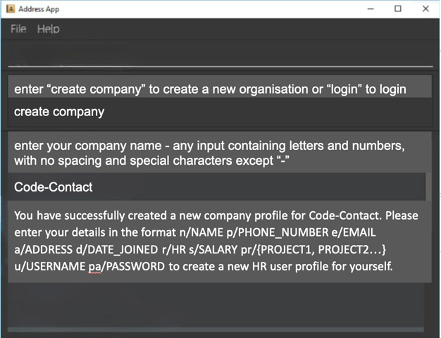
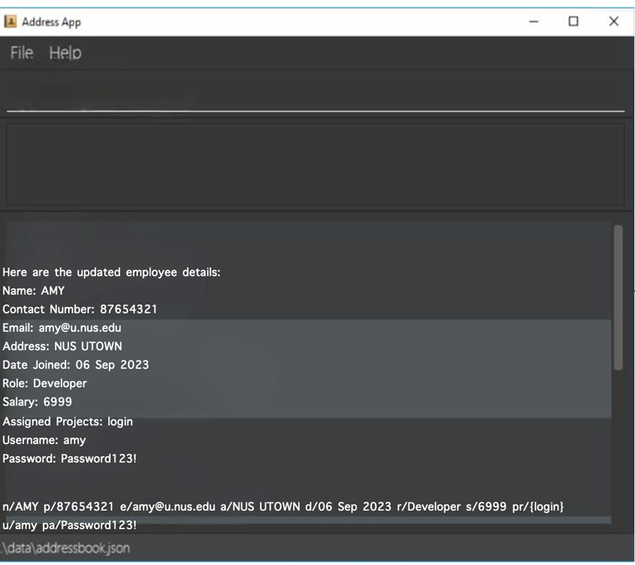
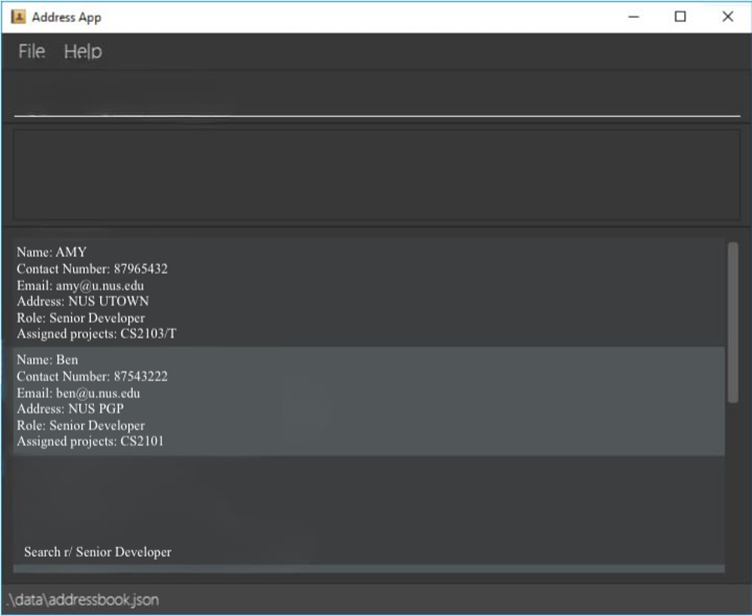

---
# CodeContact User Guide

---
CodeContact combines contact management with developer-specific and HR-specific features, making it easy for users to access coding-related contacts and project collaborators via command line.


It is a **desktop app for managing contacts, optimized for use via a Command Line Interface** (CLI) while still having the benefits of a Graphical User Interface (GUI). If you can type fast, CodeContact can get your contact management tasks done faster than traditional GUI apps.

* Table of Contents
  {:toc}

--------------------------------------------------------------------------------------------------------------------

## Quick start

1. Ensure you have Java `11` or above installed in your Computer.

1. Download the latest `addressbook.jar` from [here](https://github.com/se-edu/addressbook-level3/releases).

1. Copy the file to the folder you want to use as the _home folder_ for your AddressBook.

1. Open a command terminal, `cd` into the folder you put the jar file in, and use the `java -jar addressbook.jar` command to run the application.<br>
   A GUI similar to the below should appear in a few seconds. Note how the app contains some sample data.<br>
   

1. Type the command in the command box and press Enter to execute it. e.g. typing **`help`** and pressing Enter will open the help window.<br>
   Some example commands you can try:

    * `list` : Lists all contacts.

    * `add n/John Doe p/98765432 e/johnd@example.com a/John street, block 123, #01-01` : Adds a contact named `John Doe` to the Address Book.

    * `delete 3` : Deletes the 3rd contact shown in the current list.

    * `clear` : Deletes all contacts.

    * `exit` : Exits the app.

1. Refer to the [Features](#features) below for details of each command.

--------------------------------------------------------------------------------------------------------------------

## Features

<div markdown="block" class="alert alert-info">

**:information_source: Notes about the command format:**<br>

* Words in `UPPER_CASE` are the parameters to be supplied by the user.<br>
  e.g. in `add n/NAME`, `NAME` is a parameter which can be used as `add n/John Doe`.

* Items in square brackets are optional.<br>
  e.g `n/NAME [t/TAG]` can be used as `n/John Doe t/friend` or as `n/John Doe`.

* Items with `…`​ after them can be used multiple times including zero times.<br>
  e.g. `[t/TAG]…​` can be used as ` ` (i.e. 0 times), `t/friend`, `t/friend t/family` etc.

* Parameters can be in any order.<br>
  e.g. if the command specifies `n/NAME p/PHONE_NUMBER`, `p/PHONE_NUMBER n/NAME` is also acceptable.

* Extraneous parameters for commands that do not take in parameters (such as `help`, `list`, `exit` and `clear`) will be ignored.<br>
  e.g. if the command specifies `help 123`, it will be interpreted as `help`.

* If you are using a PDF version of this document, be careful when copying and pasting commands that span multiple lines as space characters surrounding line-breaks may be omitted when copied over to the application.
</div>

### Sign up and create new company profile
* What it does
    * Upon opening the app, users will have an option to either sign-up or login to an existing profile
      *Sign-up: HR sign up, creates a new organisation profile and creates a HR user in that organisation
* The precise command format
    * `create company <company-name>`
* example commands (to show how the command is used)
    * `create company Code-Contact`
* acceptable values for each parameter
    * any input containing letters and numbers, with no spacing and special characters except “-”
* precise expected outputs when the command succeeds
    * `You have successfully created a new company profile for company-name. Please enter your details in the format n/NAME p/PHONE_NUMBER e/EMAIL a/ADDRESS d/DATE_JOINED r/HR s/SALARY pr/{PROJECT1, PROJECT2…} u/USERNAME pa/PASSWORD to create a new HR user profile for yourself.`
* precise expected outputs when the command fails e.g., what are the error messages shown when a specific parameter is invalid, missing, specified multiple times, etc.
    * `Please enter the company-name with the correct format - any input containing letters and numbers, with no spacing and special characters except “-” is allowed.`
      

### Create new employee profiles individually (only HR)
* What it does:
    * HR can add a new employee to the list of people into the data one by one
* The precise command format
    * `create new employee`
    * `n/NAME p/PHONE_NUMBER e/EMAIL a/ADDRESS d/DATE_JOINED r/ROLE s/SALARY pr/{PROJECT1, PROJECT2…} u/USERNAME pa/PASSWORD`
* example commands (to show how the command is used)
    * User types: `create new employee`
    * CLI  shows: `Input employee details in the format below:`
      `n/NAME p/PHONE_NUMBER e/EMAIL a/ADDRESS d/DATE_JOINED r/ROLE s/SALARY pr/{PROJECT1, PROJECT2…}`
    * User types: `n/AMY p/87654321 e/amy@u.nus.edu a/NUS UTOWN d/06 Sep 2023 r/Developer s/4999 pr/{login} u/amy pa/Password123!`
* acceptable values for each parameter e.g., if a command takes a person name as a parameter, what inputs are accepted as valid person names?
    * Names can only consist of capital and small letters, spaces and hyphens.
    * Contact number has to 8 digits without spaces
    * Email has to be of the format `<TEXT>@<TEXT>`
    * Date joined has to be of format `dd mmm yyyy `(E.x 09 Sept 2022)
    * Role should be: `HR`, `manager` or `developer`
    * Salary has to be at least 4 digits
    * Project should be valid project name already listed in the company, multiple projects have to be comma separated
    * Password is at least 8 characters long, with a combination of uppercase letters, lowercase letters, numbers, and symbols
* precise expected outputs when the command succeeds e.g., changes in the GUI, messages shown to the user
    * Continuing from the above example, CLI shows:
    ```
  The following user has been added:
  Name: AMY
    Contact Number: 87654321
    Email: amy@u.nus.edu
    Address: NUS UTOWN
    Date Joined: 06 Sep 2023
    Role: Developer
    Salary: 4999
    Assigned Projects:login
    Username: amy
    Password: Password123!
  ```
* precise expected outputs when the command fails e.g., what are the error messages shown when a specific parameter is invalid, missing, specified multiple times, etc.
    * If any of the new user’s particulars (name, contact, email, username, password) match that of any other employees’ particulars, it will show a error message as follows:
        * `Error! New user’s <PARTICULAR> already exists in <COMPANY_NAME>`
    * If any of the new user’s particulars do not match the specified format for that particular, it will show the error message:
        * `Error! New user’s <PARTICULAR> does not follow the format: <FORMAT>`
        * E.x.:  `Error! New user’s name does not follow the format:
          Names can only consist of capital and small letters, spaces and hyphens.`
    * If any of the required particulars (all except Assigned Projects) is missing in the command, it will show the error message:
        * `Error! New user’s {MISSING_PARTICULARS} are missing.`


### Login (all employees)
* What it does:
    * Prompts users to enter company name
    * Prompts users to enter their login id and password
* The precise command format
    * `companydomian/ (company’s domain) userid/ (user_id) password/ (password)`
* Example commands (to show how the command is used)
    * `companydomian/ google-sg userid/ mahidharah password/ 2103TforTough!`
* acceptable values for each parameter
    * company domain must exist in database/file
    * userid must exist in companydomain file (can include characters)
    * password must match (can include characters)
    * precise expected outputs when the command succeeds e.g., changes in the GUI, messages shown to the user
    * precise expected outputs when the command fails e.g., what are the error messages shown when a specific parameter is invalid, missing, specified multiple times, etc.
    * Home page where commands can then be entered to utilise other functionality, according to user role and company

### Update details for user within a company/organisation (all employees)
* What it does:
    * Allows HR to change any details of any employee.
    * Allows employees to change only certain details such as personal particulars.
* The precise command format
    * `update employee1`
    * Modify the details that you want to change
    * `n/NAME p/PHONE_NUMBER e/EMAIL a/ADDRESS d/DATE_JOINED r/ROLE s/CHANGED_SALARY pr/{PROJECT1, PROJECT2…} u/USERNAME pa/PASSWORD`
* example commands (to show how the command is used)
    * User types: `update Amy`
    * CLI  shows: `Here are the employee details: AMY 87654321 amy@u.nus.edu NUS UTOWN 06 sept Developer 4999 amy password123`
    * User types: `n/AMY p/87654321 e/amy@u.nus.edu a/NUS UTOWN d/06 sept r/Developer s/4999 pr/{login} u/amy pa/password12345`
    * CLI  shows: `Here are the updated employee details: AMY 87654321 amy@u.nus.edu NUS UTOWN 06 sept Developer 6999 amy password123`
* acceptable values for each parameter
    * Inputs are the same as adding an employee but you just change the particular details that you want to modify.
    * Names can only consist of capital and small letters, spaces and hyphens.
    * Contact number has to 8 digits without spaces
    * Email has to be of the format <TEXT>@<TEXT>
    * Date joined has to be of format dd mmm yyyy (E.x 09 Sept 2022)
    * Role should be: HR, manager or developer
    * Salary has to be at least 4 digits
    * Project should be valid project name already listed in the company, multiple projects have to be comma separated
    * Password is at least 8 characters long, with a combination of uppercase letters, lowercase letters, numbers, and symbols
* precise expected outputs when the command succeeds e.g., changes in the GUI, messages shown to the user
    * CLI shows:
```
Here are the updated employee details:
Name: AMY
Contact Number: 87654321
Email: amy@u.nus.edu
Address: NUS UTOWN
Date Joined: 06 Sep 2023
Role: Developer
Salary: 6999
Assigned Projects:login
Username: amy
Password: Password123!
```
* precise expected outputs when the command fails e.g., what are the error messages shown when a specific parameter is invalid, missing, specified multiple times, etc.
    * If there is more than one employee with the same name: CLI will show:
        * `More than 1 person with the NAME has been found, please input employee’s phone number:`
    * If invalid inputs are given, CLI will show:
        * `Please input the employee details in the right format`
    * If an employee tries to modify details that he has no access to, CLI will show:
        * `You do not have access to modify this. Please contact your administrator.`
    * If any of the new user’s particulars do not match the specified format for that particular, it will show the error message:
        * `Error! New user’s <PARTICULAR> does not follow the format: <FORMAT>`
        * E.x.:  `Error! New user’s name does not follow the format:
          Names can only consist of capital and small letters, spaces and hyphens.`

Relevant UI mock-ups


### Search according to industry details
* What it does
    * Every user can search for contacts related to the keyword (eg. by search prj name, members of the prj team will appear)
* The precise command format
    * `Search p/<Project Name>`
    * `Search r/<Role>`
    * `Search n/<Name>`
* example commands (to show how the command is used)
    * `Search p/2103/T` (Prints everyone in 2103/T prj)
    * `Search r/Senior Developer` (Prints everyone of the senior developer role)
    * `Search n/Amy` (Prints everyone of the name Amy)
* acceptable values for each parameter
    * Incomplete inputs for string searches work too
    * Anything beyond p/ and r/ and n/does not work
    * Name must be closely following  / for more accurate output (eg. n/Amy vs n/ Amy)
* precise expected outputs when the command succeeds
    * `These are the project members for the project <Project Name>` followed by list of project members
    * `These are all the Senior Developers in this company` followed by list of senior developers
    * `This is Amy’s contact` / `These are the contact details for Amy` followed by Amy’s details or list of all the Amy’s contact
      `No relevant contact details can be found`
* precise expected outputs when the command fails e.g., what are the error messages shown when a specific parameter is invalid, missing, specified multiple times, etc.
    * If p/r/n/ is missing: `Please search with the correct input Search p/<Project Name> OR Search r/<Role> OR Search n/<Name>`
    * If users put anything outside of p/r/n/: `x/ is not a valid type to search, Please search with the correct input Search p/<Project Name> OR Search r/<Role> OR Search n/<Name>`

Relevant UI mock-ups


### Viewing help : `help`

Shows a message explaning how to access the help page.


Format: `help`


### Adding a person: `add`

Adds a person to the address book.

Format: `add n/NAME p/PHONE_NUMBER e/EMAIL a/ADDRESS [t/TAG]…​`

<div markdown="span" class="alert alert-primary">:bulb: **Tip:**
A person can have any number of tags (including 0)
</div>

Examples:
* `add n/John Doe p/98765432 e/johnd@example.com a/John street, block 123, #01-01`
* `add n/Betsy Crowe t/friend e/betsycrowe@example.com a/Newgate Prison p/1234567 t/criminal`

### Listing all persons : `list`

Shows a list of all persons in the address book.

Format: `list`

### Editing a person : `edit`

Edits an existing person in the address book.

Format: `edit INDEX [n/NAME] [p/PHONE] [e/EMAIL] [a/ADDRESS] [t/TAG]…​`

* Edits the person at the specified `INDEX`. The index refers to the index number shown in the displayed person list. The index **must be a positive integer** 1, 2, 3, …​
* At least one of the optional fields must be provided.
* Existing values will be updated to the input values.
* When editing tags, the existing tags of the person will be removed i.e adding of tags is not cumulative.
* You can remove all the person’s tags by typing `t/` without
  specifying any tags after it.

Examples:
*  `edit 1 p/91234567 e/johndoe@example.com` Edits the phone number and email address of the 1st person to be `91234567` and `johndoe@example.com` respectively.
*  `edit 2 n/Betsy Crower t/` Edits the name of the 2nd person to be `Betsy Crower` and clears all existing tags.

### Locating persons by name: `find`

Finds persons whose names contain any of the given keywords.

Format: `find KEYWORD [MORE_KEYWORDS]`

* The search is case-insensitive. e.g `hans` will match `Hans`
* The order of the keywords does not matter. e.g. `Hans Bo` will match `Bo Hans`
* Only the name is searched.
* Only full words will be matched e.g. `Han` will not match `Hans`
* Persons matching at least one keyword will be returned (i.e. `OR` search).
  e.g. `Hans Bo` will return `Hans Gruber`, `Bo Yang`

Examples:
* `find John` returns `john` and `John Doe`
* `find alex david` returns `Alex Yeoh`, `David Li`<br>
  

### Deleting a person : `delete`

Deletes the specified person from the address book.

Format: `delete INDEX`

* Deletes the person at the specified `INDEX`.
* The index refers to the index number shown in the displayed person list.
* The index **must be a positive integer** 1, 2, 3, …​

Examples:
* `list` followed by `delete 2` deletes the 2nd person in the address book.
* `find Betsy` followed by `delete 1` deletes the 1st person in the results of the `find` command.

### Clearing all entries : `clear`

Clears all entries from the address book.

Format: `clear`

### Exiting the program : `exit`

Exits the program.

Format: `exit`

### Saving the data

AddressBook data are saved in the hard disk automatically after any command that changes the data. There is no need to save manually.

### Editing the data file

AddressBook data are saved automatically as a JSON file `[JAR file location]/data/addressbook.json`. Advanced users are welcome to update data directly by editing that data file.

<div markdown="span" class="alert alert-warning">:exclamation: **Caution:**
If your changes to the data file makes its format invalid, AddressBook will discard all data and start with an empty data file at the next run. Hence, it is recommended to take a backup of the file before editing it.
</div>

### Archiving data files `[coming in v2.0]`

_Details coming soon ..._

--------------------------------------------------------------------------------------------------------------------

## FAQ

**Q**: How do I transfer my data to another Computer?<br>
**A**: Install the app in the other computer and overwrite the empty data file it creates with the file that contains the data of your previous AddressBook home folder.

--------------------------------------------------------------------------------------------------------------------

## Known issues

1. **When using multiple screens**, if you move the application to a secondary screen, and later switch to using only the primary screen, the GUI will open off-screen. The remedy is to delete the `preferences.json` file created by the application before running the application again.

--------------------------------------------------------------------------------------------------------------------

## Command summary

Action | Format, Examples
--------|------------------
**Add** | `add n/NAME p/PHONE_NUMBER e/EMAIL a/ADDRESS [t/TAG]…​` <br> e.g., `add n/James Ho p/22224444 e/jamesho@example.com a/123, Clementi Rd, 1234665 t/friend t/colleague`
**Clear** | `clear`
**Delete** | `delete INDEX`<br> e.g., `delete 3`
**Edit** | `edit INDEX [n/NAME] [p/PHONE_NUMBER] [e/EMAIL] [a/ADDRESS] [t/TAG]…​`<br> e.g.,`edit 2 n/James Lee e/jameslee@example.com`
**Find** | `find KEYWORD [MORE_KEYWORDS]`<br> e.g., `find James Jake`
**List** | `list`
**Help** | `help`
