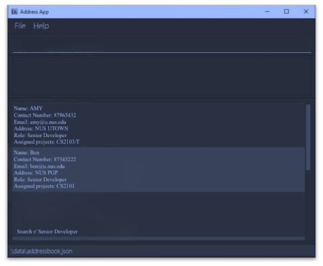

-------------------------------------------------------------------------------------
## Welcome to CodeContact
{: .no_toc}

***Taking charge of your PROject Management!***

Seamlessly integrate contact, client, and project management, simplifying access to coding-related contacts,
facilitating collaboration, and offering command-line efficiency for project managers.

CodeContact is a **desktop app for managing contacts, optimized for use via a Command Line Interface** (CLI) while still
having the benefits of a Graphical User Interface (GUI). If you can type fast, CodeContact can get your contact
management tasks done faster than traditional GUI apps. **CodeContact** aims to put the **P.R.O** in project management  by enabling project managers to be:
  > **1. Productive**
  > **2. Reliable**
  > **3. Organised**

Here’s an overview of how CodeContact can help you streamline your project management processes.
* Store and edit information about developers and clients related to projects.
* Store and manage projects and their deadlines.
* Assign projects to developers and clients.

If you are familiar with CodeContact, jump to our [**Table of Contents**](#table-of-contents) to find out what you are looking
for!

If you are new here, you may start with learning [**How to navigate this guide**](#navigating-this-guide) and visit
the [**Quick Start**](#quick-start) guide to onboard onto CodeContact smoothly!

-------------------------------------------------------------------------------------
<div style="page-break-after: always;"></div>

-------------------------------------------------------------------------------------
### How can this guide help me?
{: .no_toc}

If you are a new user, we hope to first inform you on how you can [get started](#quick-start) using CodeContact.

As you use CodeContact, you may also have questions on how to perform certain actions within the
application. This guide thus contains a comprehensive list of [Features](#features) offered with CodeContact, as well as
explanations on when and how to use them.

Further questions are also answered within a [FAQ](#faq) section below.

Confused about the terms or formatting used in this guide? Learn how to **navigate this guide** [here](#navigating-this-guide).

Confused about the visual display of CodeContact? Learn how to **navigate the user interface** of CodeContact
[here](#navigating-the-graphical-user-interface-gui).

-------------------------------------------------------------------------------------

<div style="page-break-after: always;"></div>

## Table of Contents
{: .no_toc}

* Table of Contents
{:toc}


<div style="page-break-after: always;"></div>

# **Navigating this guide**


## ***Glossary***
-------------------------------------------------------------------------------------
### **Definitions**

| Term          | Definition                                                                                                                 |
|---------------|----------------------------------------------------------------------------------------------------------------------------|
| Parameter     | Parameters are specific details you would include about the developer/client/project.(eg. name, date joined, description). |
| Command       | An input from the user that tells CodeContact to perform an action (i.e. add a client).                                    |
| GUI           | Graphical User Interface (GUI) represents the visual display of CodeContact that users can see.                            |
| GUI Component | A subsection of the Graphical User Interface. For more information on specific GUI components, refer to [this section]().  |
| CLI           | Command Line Interface (CLI) represents a text-based user interface to interact with the application.                      |
| Character     | Any letter or symbol that is recognized by the computer, and can form a line of text (eg. `a` , `+` , `$` ).               |
| JSON          | [Javascript Object Notation](https://en.wikipedia.org/wiki/JSON)                                                           |
| JAR file      | [Java Archive File](https://en.wikipedia.org/wiki/JAR_(file_format))                                                       |
| CSV file      | [Comma-separated Values File](https://en.wikipedia.org/wiki/Comma-separated_values)                                        |

[Scroll back to Table of Contents](#table-of-contents)

-------------------------------------------------------------------------------------
### **Parameter Information**

Within the tables below, you can find out more about the parameters that CodeContact supports. These parameters come in
handy when crafting commands in CodeContact.

Here are some notes about these parameters.

* Each parameter comes with **constraints**. These constraints detail the specific formats of text that
  each parameter accepts as valid user input.
    * Not following these constraints will **result in an error** when entering the command.
    * Nonetheless, CodeContact will not stop working. Rather, a message will be provided to you on
      how to correct your command.

#### Common Parameters for Developers and Clients

| Parameter | Description                      | Constraints                                                                                                                         | Valid Examples              | Invalid Examples                            |
|-----------|----------------------------------|-------------------------------------------------------------------------------------------------------------------------------------|-----------------------------|---------------------------------------------|
| `n/`      | name of developer/client | alphanumeric characters and spaces, and it should not be blank                                                                      | Tom Hanks, Elizabeth 2      | 成龍, 潔 いさぎ 世 よ 一 いち, Ganesh s/o Ravichandran |
| `p/`      | phone number of developer/client | 8 numeric characters, and it should not be blank                                                                                    | 94566835                    | 123, 432, 5678@                             |
| `e/`      | email of developer/client        | alphanumeric characters, contains an @ and it should not be blank                                                                   | amy@gmail.com               | amy!gmail.com, amy$gmail                    |
| `a/`      | address of developer/client      | alphanumeric characters and spaces, and it should not be blank                                                                      | 311, Clementi Ave 2, #02-25 | 成龍, 潔 いさぎ 世 よ 一 いち                          |
| `r/`      | role of developer/client         | alphabetical characters and spaces, and it should not be blank                                                                      | Developer                   | 成龍, 潔 いさぎ 世 よ 一 いち                          |
| `pr/`     | project name                     | alphanumeric characters and spaces, and it should not be blank, used in the context or Developer/Client when assigned to project(s) | CS2103T                     | 成龍, 潔 いさぎ 世 よ 一 いち                          |

#### Developer Specific Parameters

| Parameter | Description                  | Constraints                                                                                      | Valid Examples | Invalid Examples     |
|----------|------------------------------|--------------------------------------------------------------------------------------------------|----------------|----------------------|
| `g/`     | github username of developer | alphanumeric characters, follows github username convention and it should not be blank           | johng, amy123  | g, y                 |
| `d/`     | date joined of developer     | numeric characters in dd-MM-yyyy format, should not be a future date, and it should not be blank | 11-11-2023     | 19-11-2024, 1/1/2023 |
| `s/`     | salary of developer          | positive integers of at least 4 digits, should not be blank                                      | 5000           | 5000.0, 4321.32.22   |
| `rt/`    | rating of developer          | numeric characters between 0 to 5                                                                | 5, 3.5         | -0, -1, 6            |

<div style="page-break-after: always;"></div>

#### Client Specific Parameters

| Parameter | Description                 | Constraints                                                                                       | Valid Examples | Invalid Examples |
|-----------|-----------------------------|---------------------------------------------------------------------------------------------------|----------------|------------------|
| `o/`      | organisation name of client | alphanumeric characters and spaces, and it should not be blank                                    | Google         | 谷歌               |
| `do/`     | document link of client     | alphanumeric characters and spaces, and it should not be blank, follows standard hyperlink format | google.com     | 谷歌.com           |

#### Project Parameters

| Parameter | Description            | Constraints                                                    | Valid Examples                                  | Invalid Examples                   |
|-----------|------------------------|----------------------------------------------------------------|-------------------------------------------------|------------------------------------|
| `n/`     | name of project | alphanumeric characters and spaces, and it should not be blank | CodeContact, oribtal23, Team Trekker | 成龍, 潔 いさぎ 世 よ 一 いち                 |
| `dr/`     | description of project | alphanumeric characters and spaces, and it should not be blank | App to allow for different juices to be ordered | 成龍, 潔 いさぎ 世 よ 一 いち                 |
| `dl/`     | deadline of project    | alphanumeric characters and spaces, and it should not be blank | 19-12-2023, Design backend, HIGH, 0             | 19.1.2023, 潔 いさぎ 世 よ 一 いち, NONE, 5 |
| `pri/`    | priority of deadline   | HIGH, MEDIUM, LOW                                              | HIGH, MEDIUM, LOW                               | 5, 3.5, -1, high, M                |


### **Format**
-------------------------------------------------------------------------------------
#### General Formatting
Here are the explanations behind the formatting we use through this guide.<br>

* Words in `grey blocks (like these)` usually represent any of the following:
    1. Text used in commands, such as `add-developer`.
    2. Keys on your keyboard like `Enter`.
    3. File names such as `CodeContact.jar`.
       <br>
<div markdown="block" class="alert alert-info">
:bulb: This is a blue box. It can be used for additional tips or more useful information.
</div>

<div markdown="block" class="alert alert-warning">
:exclamation: This is a warning box. It can be used to give more details on the warnings and limitations of features.
</div>

#### Command Formatting

| Format                                       | Explanation                                                        | Example                            |
|----------------------------------------------|--------------------------------------------------------------------|------------------------------------|
| words in `UPPER_CASE`                        | **compulsory** parameter values that are supplied by the user         | `add-developer n/NAME p/PHONE` |
| words in `[UPPER_CASE]` with square brackets | **optional** parameter values that are supplied by the user            | `add-developer n/NAME p/PHONE [d/DATE_JOINED]` |
| Items with `…` after them                    | parameters that can be used **multiple times**                        | `add-developer [pr/PROJECT]...`    |


[Scroll back to Table of Contents](#table-of-contents)

-----------------------------------------------------------------------------------------------
<div style="page-break-after: always;"></div>

## ***Navigating the Graphical User Interface (GUI)***
CodeContact comes with a GUI to allow for nice visual feedback for our users. Here is a quick run-through
of the different sections of our GUI, as well as some notes regarding the use of the GUI.
### Quick Orientation

<br><br>


**Here is a quick summary of each GUI component within CodeContact:**

| Name                             | Description                                                                                                                                                                                                |
|----------------------------------|------------------------------------------------------------------------------------------------------------------------------------------------------------------------------------------------------------|
| Menu Bar                         | Contains dropdown menu options for the CodeContact application.                                                                                                                                            |
| Command Box                      | Allows users to enter CodeContact commands.                                                                                                                                                                |
| Result Display                   | 1. Provides CLI-based feedback upon a user command. <br> 2. Allows users to see if their command was successful or not. <br> 3. Provides error messages to guide users on how to use CodeContact commands. |
| Tabs                             | Allows users to see different lists of information on clicking on the relevant tabs. The tabs will also automatically switch to the correct tab corresponding to the command executed.                     |
| Developers/Clients/Projects card | Displays a list of Developer, Client or Project Cards. This list can be manipulated through commands like `find` and `list`.                                                                               |
| Deadlines progress               | Displays the progress of deadlines for a certain project.                                                                                                                                                  |
| Deadline list with details       | Displays the details of the deadline in a table form.                                                                                                                                                      |
| Re-sort                          | Click on the respective words, there will be a small black arrow that appears. You can press to resort the data eg. show date from furthest to nearest day.                                                |

### Notes on GUI
<div markdown="block" class="alert alert-warning">
If you executed a `find` command in developer tab and switched to the client tab, when you return to the developer tab the find results will be cleared and
the whole list of developers will be shown again. This is the intended behavior of CodeContact as we hope that this can save you the time
from always needing to call the list command.
</div>

--------------------------------------------------------------------------------------------------------------------
<div style="page-break-after: always;"></div>

## ***Quick start***

1. Ensure you have Java `11` or above installed in your Computer.    


2. Download the latest `CodeContact.jar`.    


3. Copy the file to the folder you want to use as the _home folder_ for your CodeContact.


4. Open a command terminal, `cd` into the folder you put the jar file in, and use the `java -jar CodeContact.jar`
   command to run the application.<br>


5. A GUI similar to the below should appear in a few seconds. Note how the app might contain some sample data.<br>
   


6. For new users, learn to use CodeContact through our [Tutorial](#codecontact-tutorial--for-new-users-).


7. Refer to the [Features](#features) below for details of each command.


[Scroll back to Table of Contents](#table-of-contents)

--------------------------------------------------------------------------------------------------------------------


## ***CodeContact Tutorial (for new users)***

This is a tutorial for **first-time** CodeContact users.

1. Launch CodeContact. You may refer to the instructions [here](#quick-start).
    * On launch, CodeContact will not contain any developer or client records.
    <br/>
  

2. You will be asked to **enter a password** to unlock CodeContact.
    * Enter the command `unlock pw/Password123!` in the command box.
    <br/>


3. You can **change the password** to unlock CodeContact.
    * Enter the command `change-password pw/Password123! npw/<yourNewPassword>` in the command box.

<div markdown="block" class="alert alert-info">:bulb:
You can always lock and unlock CodeContact using the `lock` and `unlock` commands.
</div>

1. Let us try **adding a project** to our CodeContact.
    * Enter the
      command `add-project n/AndroidApp dr/App to allow for different juices to be ordered dl/19-12-2023,Design backend,HIGH,0 dl/25-12-2023,Design frontend,MEDIUM,0 `.
   <br/>


2. We can then **add a developer** to our CodeContact.
    * Enter the
      command `add-developer n/John Doe p/98765432 e/johnd@example.com a/311, Clementi Ave 2, #02-25 r/Developer pr/AndroidApp s/4500 d/01-11-2023 g/johng rt/3`.
    * Try adding more developers with different details for each parameter!
    * Remember to add a new [project](#add-project--add-project) or [role](#add-roles) if you wish to add new developers with other roles and
      project.
   <br/>


3. We can also **add a client** to our CodeContact.
    * Enter the
      command `add-client n/Amy p/88765423 e/amy@example.com a/31, Clementi Ave 6, #03-12 r/Client pr/AndroidApp o/Google do/google.com`.
    * Try adding more clients with different details for each parameter!
    * Remember to add a new [project](#add-project--add-project) or [role](#add-roles) if you which to add new client with other roles and project.
   <br/>


4. Let us try **editing the name** of a developer stored in CodeContact.
    * Enter the command `edit-developer 1 n/Jhonny`.
    * Try editing other parameters or developers and projects too!
    * More details of what you can edit can be found [here](#edit).
   <br/>


5. We can also easily **find** for information in CodeContact.
    * Enter the command `find-developer n/John s/4500`.
    * Try looking for other information and search with multiple parameters!
    * More details of what you can find can be found [here](#find).
   <br/>


6. You can always **show the full list** after finding in CodeContact.
    * Enter the command `list-developer`, `list-client` or `list-project`.
   <br/>


7. You can **delete developers, clients or projects** in CodeContact.
    * Enter the command `delete-developer 3` to delete the 3rd developer in CodeContact.
    * More details on how delete works can be found [here](#delete-developer--delete-developer).
   <br/>


8. If you realise that you did not delete this developer, you can **undo** this action in CodeContact.
    * Enter the command `undo` and it will revert your previous actions.
   <br/>


9. If you realise you actually want it deleted, you can **redo** this action in CodeContact.
    * Enter the command `redo` and it will redo your previous actions.
   <br/>


Congratulations! You are now ready to use CodeContact!

To view all our features, you may visit our [Features](#features) section.

[Scroll back to Table of Contents](#table-of-contents)

--------------------------------------------------------------------------------------------------------------------
<div style="page-break-after: always;"></div>

# **Features**


| [Security Features](#security-features)     | Locking Access to features | Unlocking Access to features |              Changing personal password               |
|:--------------------------------------------|:--------------------------:|:----------------------------:|:-----------------------------------------------------:|
| [Password Protection](#password-protection) |    [`lock`](#lock-lock)    |  [`unlock`](#unlock-unlock)  | [`change-password`](#change-password-change-password) |

| [Management Features](#management-features)         |                                 Developer                                 |                              Client                              |                                                         Project                                                          |
|:----------------------------------------------------|:-------------------------------------------------------------------------:|:----------------------------------------------------------------:|:------------------------------------------------------------------------------------------------------------------------:|
| [Adding new information](#add)                      |             [`add-developer`](#add-developer--add-developer)              |             [`add-client`](#add-client--add-client)              |                                        [`add-project`](#add-project--add-project)                                        |
| [Deleting information](#delete)                     |         [`delete-developer`](#delete-developer--delete-developer)         |         [`delete-client`](#delete-client--delete-client)         |                                   [`delete-project`](#delete-project--delete-project)                                    |
| [Editing information](#edit)                        |        [`edit-developer`](#edit-developer-details--edit-developer)        |        [`edit-client`](#edit-client-details--edit-client)        |                                  [`edit-project`](#edit-project-details--edit-project)                                   |
| [Importing information](#import-information)        |        [`import-developer` ](#import-developers-import-developer)         |         [`import-client`](#import-clients-import-client)         |                                                            -                                                             |
| [Finding information](#find)                        |                [`find-developer`](#find-developer-details)                |              [`find-client`](#find-client-details)               |                [`find-project`](#find-project-details), [`find-deadline`](#find-deadlines-find-deadline)                 |
| [Listing information](#listing-information--list)   |                             `list-developer`                              |                          `list-client`                           |                                                      `list-project`                                                      |
| [Adding new role](#add-roles)                       |     [`add-developer-role`](#add-developer-roles--add-developer-role)      |     [`add-client-role`](#add-client-roles--add-client-role)      |                                                            -                                                             |
| [Deleting role](#delete-roles)                      | [`delete-developer-role`](#delete-developer-roles--delete-developer-role) | [`delete-client-role`](#delete-client-roles--delete-client-role) |                                                            -                                                             |
| [Marking Project Deadlies](#mark-project-deadlines) |                                     -                                     |                                -                                 | [`mark-deadline`](#mark-deadline-as-done--mark-deadline), [`unmark-deadline`](#mark-deadline-as-undone--unmark-deadline) |

| [Additional Features](#additional-features)       |              Finding Help               |                     Clearing data                     |                  Exiting program                  |
|:--------------------------------------------------|:---------------------------------------:|:-----------------------------------------------------:|:-------------------------------------------------:|
| [Miscellaneous Features](#miscellaneous-features) | [View Help `help`](#viewing-help--help) | [Clear entries `clear`](#clearing-all-entries--clear) | [Exit program `exit`](#exiting-the-program--exit) |

--------------------------------------------------------------------------------------------------------------------
<div style="page-break-after: always;"></div>

## ***Security Features***

--------------------------------------------------------------------------------------------------------------------
### **Password Protection**

> **Grant yourself exclusive access and deny access by others to CodeContact with a personal and
> customizable password.**


#### Lock : `lock`

> Locks the system and hides all the information, denying access to all information and commands
> except `unlock`, `help`, and `delete`.

**Format:** `lock`

**Example of usage:** `lock`

When command succeeds, CLI shows:

```
Locked all data
```

[Scroll back to Table of Contents](#table-of-contents)

--------------------------------------------------------------------------------------------------------------------
#### Unlock : `unlock`

> Unlocks the system by granting access to all information and commands.

**Format:** `unlock pw/CURRENT_PASSWORD`

**Constraints:**    
1. Only unlocks if password exactly matches the current password (which is the last set password).
   * Note: The default password is `Password123!`. It is highly recommended to change to a different password with the [`change-password` command](#change-password-chanage-password).

**Example of usage:** `unlock pw/Password123!`

When command succeeds, CLI shows:
```
Unlocked all data
```

[Scroll back to Table of Contents](#table-of-contents)

--------------------------------------------------------------------------------------------------------------------
#### Change password : `change-password`

> Changes the current password so that the password is kept personal.

**Format:** `change-password pw/CURRENT_PASSWORD npw/NEW_PASSWORD`

**Constraints:**    
1. `CURRENT_PASSWORD` entered must exactly match the current password.
    * Note: The default password is `Password123!`.
    
2. `NEW_PASSWORD` must be at least 8 characters long and contain at least one digit, one lowercase letter,
  one uppercase letter, and one special character.

**Example of usage:** `change-password pw/Password123! npw/NewPass987!`

When command succeeds, CLI shows:
```
Password changed successfully.
```

[Scroll back to Table of Contents](#table-of-contents)

--------------------------------------------------------------------------------------------------------------------
<div style="page-break-after: always;"></div>

## ***Management Features***

--------------------------------------------------------------------------------------------------------------------
### **Add**
> **Your accessible command to easily add relevant project details into CodeContact.**


#### Add developer : `add-developer`

> Adds a new developer to the address book with the entered details.

**Format:**
`add-developer n/NAME p/PHONE_NUMBER e/EMAIL a/ADDRESS [d/DATE_JOINED] r/ROLE s/SALARY [pr/PROJECT_NAME]... g/GITHUB_ID rt/RATING`

**Constraints:**
1. `NAME` cannot be the same as another existing developer's name in the address book. Checks are case-insensitive.
2. `PROJECT_NAME` should be the exact name of an existing project if specified.   
If project to be assigned does not exist, consider [adding the project](#add-project--add-project) first!


**Optional Fields:**    
  1. `PROJECT_NAME` - if prefix pr/ is missing in the command, the added developer will not be assigned to any projects.
     
  2. `DATE_JOINED`  - if prefix d/ is missing in the command, the added developer's date joined field will automatically reflect today's date.


* Note that for `RATING` values that are not in increments of 0.5 (eg. 3.2 or 3.8 instead of 3.0 or 3.5), the decimal portion
  may not be reflected as clearly in the coloured stars.


**Example of usage:**    
`add-developer n/John Doe p/98765432 e/johnd@example.com a/311, Clementi Ave 2, #02-25 r/Developer 
pr/AndroidApp pr/CustomWebsite s/4500 d/11-11-2023 g/johng rt/3`


* A new developer, `John Doe`, is added with the respective details.
* He is assigned to the projects `AndroidApp` and `CustomWebsite` (provided that these projects already exist in the address book).


When command succeeds, CLI shows:
```
New developer added: John Doe;
Phone: 98765432;
Email: johnd@example.com;
Address: 311, Clementi Ave 2, #02-25;
Date Joined: 11-11-2023;
Role: Developer;
Salary: 4500;
Projects: CustomWebsite AndroidApp
```

<div markdown="block" class="alert alert-info">:bulb:
Entered details of a developer incorrectly? You can always undo the action with the [`undo`](#undo) command!
</div>

[Scroll back to Table of Contents](#table-of-contents)

--------------------------------------------------------------------------------------------------------------------
#### Add client : `add-client`

> Adds a new client to the address book, with the entered details.

**Format:**
`add-client n/NAME p/PHONE e/EMAIL a/ADDRESS r/ROLE [pr/PROJECT]... o/ORGANISATION do/DOCUMENT`

**Constraints:**
1. `NAME` cannot be the same as another existing client's name in the address book. Checks are case-insensitive.
  
2. `PROJECT_NAME` should be the exact name of an existing project if specified.    
If project to be assigned does not exist, consider [adding the project](#add-project--add-project) first!

**Optional Fields:**
1. `PROJECT_NAME` - if prefix pr/ is missing in the command, the added developer will not be assigned to any projects.

**Example of usage:**
`add-client n/Jack Doe p/98765432 e/jackd@example.com a/311, Clementi Ave 2, #02-25 r/Developer pr/AndroidApp pr/CustomWebsite o/Google do/google.com`


* A new client, `Jack Doe`, is added with the respective details
* He is assigned to the projects `AndroidApp` and `CustomWebsite` (provided that these projects already exist in the address book).


When command succeeds, CLI shows:

```
New client added: Jack Doe;
Phone: 98765432;
Email: jackd@example.com;
Address: 311, Clementi Ave 2, #02-25;
Organisation: Google;
Role: Developer;
Document: google.com;
Projects: CustomWebsite AndroidApp
```

<div markdown="block" class="alert alert-info">:bulb:
Entered details of a client incorrectly? You can always undo the action with the [`undo`](#undo) command!
</div>

[Scroll back to Table of Contents](#table-of-contents)

--------------------------------------------------------------------------------------------------------------------
#### Add project : `add-project`

> Adds a new project and its relevant deadlines to the address book, with the entered details.

**Format:**
`add-project n/NAME dr/DESCRIPTION [dl/DEADLINE_DATE,DEADLINE_DESCRIPTION,PRIORITY,IS_DONE]...`

**Constraints:**
1. `NAME` cannot be the same as another existing project's name in the address book. Checks are case-insensitive.

**Optional Fields:**
1. `DEADLINE` - if prefix dl/ is missing in the command, the added project will not have any deadlines assigned to it.

**Example of usage:**    
`add-project n/JuiceApp dr/App to allow for different juices to be ordered dl/19-12-2023,Design backend,HIGH,0 dl/25-12-2023,Design frontend,MEDIUM,0`


* A new project, `JuiceApp`, is added with the respective details.
* Deadlines with the descriptions `Design backend` and `Design frontend` are created and assigned to the newly added project.


When command succeeds, CLI shows:

```
New project added: JuiceApp;
Description: App to allow for different juices to be ordered;
Deadlines:
1. Design backend by: 19-12-2023, priority: HIGH (undone)
2. Design frontend by: 25-12-2023, priority: MEDIUM (undone)
```

<div markdown="block" class="alert alert-info">:bulb:
Entered details of a project incorrectly? You can always undo the action with the [`undo`](#undo) command!
</div>

[Scroll back to Table of Contents](#table-of-contents)

--------------------------------------------------------------------------------------------------------------------
<div style="page-break-after: always;"></div>

### **Delete**
> **Your quick command to delete project details effectively into CodeContact.**


#### Delete developer : `delete-developer`

> Deletes developer in the address book and their respective list.

**Format:** `delete-developer INDEX`

**Constraints:**
1. `INDEX` cannot be greater than the number of developers in the list.

**Example of usage:** `delete-developer 2`

When command succeeds, CLI shows:

```
Deleted Developer: Bernice Yu;
Phone: 99272758;
Email: berniceyu@example.com;
Address: Blk 30 Lorong 3 Serangoon Gardens, #07-18;
Date Joined: 16-11-2020;
Role: Developer;
Salary: 6000;
Projects: Appollo Orbital
```
if second developer in the list was Bernice Yu.

<div markdown="block" class="alert alert-info">:bulb:
Deleted a wrong developer? You can always undo the action with the [`undo`](#undo) command!
</div>

[Scroll back to Table of Contents](#table-of-contents)

--------------------------------------------------------------------------------------------------------------------
<div style="page-break-after: always;"></div>

#### Delete client : `delete-client`

> Deletes client in the address book and their respective list.

**Format:** `delete-client INDEX`

**Constraints:**
1. `INDEX` cannot be greater than the number of clients in the list.

**Example of usage:** `delete-client 3`    

When command succeeds, CLI shows:
```
Deleted Client: George Lim;
Phone: 76543210;
Email: george@example.com;
Address: Blk 789 Woodlands Ave 6, #03-03;
Organisation: MNO Company;
Role: Developer;
Document: https://www.mno.com/;
Projects: CodeContact
```
if second client in the list was George Lim.

<div markdown="block" class="alert alert-info">:bulb:
Deleted a wrong client? You can always undo the action with the [`undo`](#undo) command!
</div>

[Scroll back to Table of Contents](#table-of-contents)

--------------------------------------------------------------------------------------------------------------------
<div style="page-break-after: always;"></div>

#### Delete project : `delete-project`

> Deletes the details of an existing project in the address book and their respective list.
> Updates developer and client project details accordingly.

**Format:** `delete-project INDEX`

**Constraints:**
1. `INDEX` cannot be greater than the number of projects in the list.

**Example of usage:** `delete-project 2`


* Deletes second project in the project list from the project list and from the address book.
* Deletes project from developers' and clients' project lists if they were assigned to this project.


When command succeeds, CLI shows:
```
Deleted Project: TeamTrekker;
Description: A team collaboration tool;
Deadlines:
1. Phase 2 by: 13-11-2021, priority: MEDIUM (undone)
```
if second project in the list was TeamTrekker.

<div markdown="block" class="alert alert-warning">
:exclamation: **Note**: This command deletes **project from developers' and clients' project lists** if they were assigned to this project.
</div>


<div markdown="block" class="alert alert-info">:bulb:
Deleted a wrong project? You can always undo the action with the [`undo`](#undo) command!
</div>

[Scroll back to Table of Contents](#table-of-contents)

--------------------------------------------------------------------------------------------------------------------
<div style="page-break-after: always;"></div>

### **Edit**
> **Your quick and accessible CodeContact command to edit your ever changing project details**


#### Edit developer details : `edit-developer`

> Edits the details of an existing developer in the address book.

**Format:**
`edit-developer INDEX [n/NAME] [p/PHONE_NUMBER] [e/EMAIL] [a/ADDRESS] [d/DATE_JOINED] [r/ROLE] [s/SALARY] [pr/PROJECT_NAME]... [g/GITHUB_ID] [rt/RATING]`

**Constraints:**
1. `NAME` cannot be the same as another existing developer's name in the address book. Checks are case-insensitive.
   You can, however, edit the casing of an existing developer's `NAME`.
2. `PROJECT_NAME` should be the exact name of an existing project. 
3. At least one of the optional fields must be provided.

**Additional Notes:**
* Existing values will be updated to the input values.
* When editing projects, the existing assigned projects of the developer will be removed i/e. adding of projects is not
  cumulative.
* You can remove all the developer's projects by typing `pr/` without specifying any project name after it.
* `RATING` values that not in increments of 0.5 (eg. 3.2 or 3.8 instead of 3.0 or 3.5), the decimal portion
  may not be reflected as clearly in the coloured stars.

**Example of usage:**
`edit-developer 2 p/98989898 pr/Project2 pr/Project3`

* Edits `Amy`'s phone number to `98989898` and changes the projects assigned to her to `Project2` and `Project3`.

When command succeeds, CLI shows:

```
Edited Developer: Amy
Phone: 98989898
Email: amy@u.nus.edu
Address: NUS UTOWN
Date Joined: 06-09-2023
Role: Developer
Salary: 6999
Projects: Project3 Project2
```

<div markdown="block" class="alert alert-info">:bulb:
You can always undo the action with the [`undo`](#undo) command!
</div>

[Scroll back to Table of Contents](#table-of-contents)

--------------------------------------------------------------------------------------------------------------------
#### Edit client details : `edit-client`

> Edits the details of an existing client in the address book.

**Format:**
`edit-client INDEX [n/NAME] [p/PHONE_NUMBER] [e/EMAIL] [a/ADDRESS] [pr/PROJECT_NAME]...  [o/ORGANISATION]`

**Constraints:**
1. `NAME` cannot be the same as another existing client's name in the address book. Checks are case-insensitive.
   You can, however, edit the casing of an existing client's `NAME`.
2. `PROJECT_NAME` should be the exact name of an existing project.
3. At least one of the optional fields must be provided.

**Additional Notes:**
* Existing values will be updated to the input values.
* When editing projects, the existing assigned projects of the client will be removed i/e. adding of projects is not
  cumulative.
* You can remove all the client's projects by typing `pr/` without specifying any project name after it.
* `RATING` values that not in increments of 0.5 (eg. 3.2 or 3.8 instead of 3.0 or 3.5), the decimal portion
  may not be reflected as clearly in the coloured stars.

**Example of usage:**
`edit-client 3 e/bob@gmail.com`

* Edits `Bob`'s email to `bob@gmail.com`.

When command succeeds, CLI shows:

```
Edited Client: Bob;
Phone: 87654321;
Email: bob@gmail.com;
Address: Blk 123 Banana Road;
Organisation: Google;
Document: google.com
Projects: ProjectA
```
<div markdown="block" class="alert alert-info">:bulb:
You can always undo the action with the [`undo`](#undo) command!
</div>

[Scroll back to Table of Contents](#table-of-contents)

--------------------------------------------------------------------------------------------------------------------
#### Edit project details : `edit-project`

> Edits the details of an existing project in the address book.

**Format:**
`edit-project INDEX [dr/DESCRIPTION] [dl/DEADLINE]...`

**Constraints:**
1. The name of a project cannot be edited.
2At least one of the optional fields must be provided.

**Additional Notes:**
* Existing values will be updated to the input values.
* When editing deadlines, the existing deadlines will be removed ie. adding of projects is not cumulative.
* You can remove all the current deadlines by typing `dl/` without specifying any deadline.

**Example of usage:**
`edit-project 1 dl/19-12-2023,Design backend,HIGH,0`

* Deletes existing project deadlines and adds new deadline `Design backend by: 19-12-2023, priority: HIGH (undone)`.

When command succeeds, CLI shows:

```
Edited Project: JuiceApp;
Description: Juice ordering app;
Deadlines:
1. Design backend by: 19-12-2023, priority: HIGH (undone)
```
<div markdown="block" class="alert alert-info">:bulb:
You can always undo the action with the [`undo`](#undo) command!
</div>

[Scroll back to Table of Contents](#table-of-contents)

--------------------------------------------------------------------------------------------------------------------
<div style="page-break-after: always;"></div>

### **Import**
> **Your lightning-fast and reliable way of porting over existing project details into CodeContact.**


#### Import developers' details : `import-developer`

> Reads a CSV file and populates the addressbook with the developers provided.

**Command Format:** `import-developer FILENAME`

**Column Header Format (for CSV file):** `Name`, `Contact Number`, `Email`, `Address`, `Date Joined`, `Role`, `Salary`, `GithubId`, `Rating`, `Projects`

**Constraints:**    
1. The CSV file has to be in the same folder as the JAR file for the command to function correctly.

2. The CSV file has to strictly follow the column header names and order (given in the example).    
   The entire command will abort if any of column headers do not follow the given format.

3. `NAME` and `PROJECT_NAME` fields for developers to be added via the import feature have the same constraints as the [`add-developer` command](#add-developer--add-developer) constraints.    
   The entire command will abort if any of the rows have invalid values that do not comply with given constraints.    

**Optional Fields:**     
While `PROJECT` and `DATE JOINED` column headers are compulsory, they are optional fields, where values (corresponding to the developer to be added) under these columns can be empty.    

If values are empty, corresponding developers will be added with `DATE JOINED` automatically set to today and/or with no projects assigned to them, like the [`add-developer` command](#add-developer--add-developer).


Example of valid CSV:

```
Name, Contact Number, Email, Address, Date Joined, Role, Salary, GithubId, Rating, Projects,,
faiz,87654321,faiz@u.com,utown,12-12-2020,Developer,3333,Faizgit,5,AndroidApp,ProjectB,
John,123456789,john@email.com,123 Main St,01-01-2021,Developer,4000,JohnDesigns,4,AndroidApp,ProjectB,
Sarah,987654321,sarah@email.com,456 Elm St,05-10-2019,Developer,6000,SarahManager,5,AndroidApp,ProjectB,ProjectC
Alex,555555555,alex@email.com,789 Oak St,03-01-2022,Developer,5500,AlexDev,4,AndroidApp,ProjectB,
Emily,111111111,emily@email.com,321 Pine St,08-10-2018,Developer,4800,EmilyAnalyst,4,AndroidApp,ProjectB,
Michael,999999999,michael@email.com,567 Birch St,06-03-2020,Developer,7000,MichaelEngineer,5,AndroidApp,ProjectB,
```

**Example of usage:** `import-developer developers.csv`

Reads `developers.csv` and adds a new developer for each row of data.

When command succeeds, CLI shows:
```
New developer added: faiz;
Phone: 87654321;
Email: faiz@u.com;
Address: utown;
Date Joined: 12-12-2020;
Role: Developer;
Salary: 3333;
Projects: ProjectB AndroidApp
```
for each developer successfully added.

[Scroll back to Table of Contents](#table-of-contents)

--------------------------------------------------------------------------------------------------------------------
#### Import clients' details : `import-client`

Reads a CSV file and populates the addressbook with the clients provided.

**Command Format:** `import-client FILENAME`

**Column Header Format (for CSV file):** `Name`, `Contact Number`, `Email`, `Address`, `Role`, `Organisation`, `Document`, `Projects`


**Constraints:**    
1. The CSV file has to be in the same folder as the JAR file for the command to function correctly.
   
2. The CSV file has to strictly follow the column header names and order (given in the example).    
   The entire command will abort if any of column headers do not follow the given format.

3. `NAME` and `PROJECT_NAME` fields for clients to be added via the import feature have the same constraints as the [`add-client` command](#add-client--add-client) constraints. The entire command will abort if any of the rows have invalid values that do not comply with given constraints.    

**Optional Fields:**       
While the `PROJECT` column header is compulsory, it is an optional fields, where values (corresponding to the client to be added) under this column can be empty.    

If values under the `PROJECT` column are empty, corresponding clients will be added with no projects assigned to them, like the [`add-client` command](#add-client--add-client).


Example of valid CSV:
```
Name, Contact Number, Email, Address, Role, Organisation, Document, Projects,
Mahi,87554321,mahi@u.com,utown,HR,Google,docs.google.com/abd,AndroidApp,ProjectB
Jane,654321876,jane@email.com,456 Oak St,HR,Acme Corp,acme.com/docs,AndroidApp
Robert,987123456,robert@email.com,789 Elm St,HR,Tech Solutions,techdocs.com/123
Maria,321987654,maria@email.com,123 Maple St,HR,Innovate Inc,innovate.com/docs
Chris,876543219,chris@email.com,567 Pine St,HR,Data Insights,datainsights.com/docs
Laura,888555555,laura@email.com,101 Birch St,HR,Software Systems,software.com/docs
```

**Example of usage:** `import-client clients.csv`

Reads `clients.csv` and adds a new client for each row of data.

When command succeeds, CLI shows:

```
New client added: Mahi;
Phone: 87554321;
Email: mahi@u.com;
Address: utown;
Organisation: Google;
Role: HR;
Document: docs.google.com/abd;
Projects: ProjectB AndroidApp
```

for each client successfully added.

[Scroll back to Table of Contents](#table-of-contents)

--------------------------------------------------------------------------------------------------------------------
<div style="page-break-after: always;"></div>

### **Find**

> **Your go-to command to quickly access precise information in CodeContact.**


#### Find developer details : `find-developer`

> Finds the details of an existing developer in the address book.

**Format:**
`find-developer [n/NAME] [p/PHONE_NUMBER] [e/EMAIL] [a/ADDRESS] [d/DATE_JOINED] 
[r/ROLE] [s/SALARY] [pr/PROJECT_NAME] [g/GITHUB_ID] [rt/RATING]`

**Additional notes:**
* Finds for developers based on the attributes provided.
* At least one of the optional fields must be provided.
* Existing values will be compared to the input values, and the results will include any items that match the provided
  criteria.
* You can combine multiple attributes for a more specific search.
* The search is case-insensitive, so you can use any case for the search criteria.

**Example of usage:**
`find-developer pr/2103T rt/5.0`

* Prints developers in 2103/T project with a 5-star rating.

When command succeeds, CLI shows:

```
This is the one developer with matching information.
```


[Scroll back to Table of Contents](#table-of-contents)

--------------------------------------------------------------------------------------------------------------------
#### Find client details : `find-client`

> Finds the details of an existing client in the address book.

**Format:**
`find-client [n/NAME] [p/PHONE] [e/EMAIL] [a/ADDRESS] [o/ORGANISATION] [pr/PROJECT] [d/DOCUMENT]`

**Additional notes:**
* Finds for clients based on the attributes provided.
* At least one of the optional fields must be provided.
* Existing values will be compared to the input values, and the results will include any items that match the provided
  criteria.
* You can combine multiple attributes for a more specific search.
* The search is case-insensitive, so you can use any case for the search criteria.

**Example of usage:** 
`find-client o/Google r/Senior developer`

* Prints clients from Google with the Senior developer role.

When command succeeds, CLI shows:

```
These are the 2 clients with matching information.
```


[Scroll back to Table of Contents](#table-of-contents)

--------------------------------------------------------------------------------------------------------------------
#### Find project details : `find-project`

> Finds the details of an existing project in the address book.

**Format:** `find-project [pr/PROJECT_NAME] [dr/DESCRIPTION] [dl/DEADLINE]`

**Additional notes:**
* Finds for projects based on the attributes provided.
* At least one of the optional fields must be provided.
* Existing values will be compared to the input values, and the results will include any items that match the provided
  criteria.
* You can combine multiple attributes for a more specific search.
* The search is case-insensitive, so you can use any case for the search criteria.

**Example of usage:** `find-project pr/JuiceApp`

* Print projects with the name JuiceApp.

When command succeeds, CLI shows:

```
This is the one project with matching information.
```

[Scroll back to Table of Contents](#table-of-contents)

--------------------------------------------------------------------------------------------------------------------
#### Find deadlines : `find-deadline`

> Finds deadlines in project tab based on date and/or priority.

**Format:** `find-deadline [d/DATE] [pri/PRIORITY]`

**Additional notes:**
* When finding deadlines based on `DATE`, the project tab displays deadlines due before or on the specified date.
* When finding deadlines based on `PRIORITY`, only that priority (`HIGH`,`MEDIUM`, `LOW`) deadlines are shown.

**Example of usage:** `find-deadline d/20-11-2023 pri/MEDIUM`

* Shows deadlines due before or on `20-11-2023` and with `MEDIUM` priority.

When command succeeds, CLI shows:

```
These are the 3 projects with matching information.
```

[Scroll back to Table of Contents](#table-of-contents)

--------------------------------------------------------------------------------------------------------------------
<div style="page-break-after: always;"></div>

### **List**
> **Your command to view all relevant details in and your keyboard alternative to switching through tabs in CodeContact**


#### List information : `list`

> Shows a list of all developers in the address book.

**Format:** `list-TYPE`

* Lists the specific type of thing you are asking.

**Example of usage:** `list-developer`

* Lists all the developers.

**Acceptable parameters**:

* `developer` to list the developers
* `client` to list the clients
* `project` to list the projects

When command succeeds, CLI shows:

```
Listed all developers
```

[Scroll back to Table of Contents](#table-of-contents)

--------------------------------------------------------------------------------------------------------------------

<div style="page-break-after: always;"></div>

### **Add roles**
> **Your command to take control of the type of roles available in CodeContact.**


#### Add developer roles : `add-developer-role`

> Adds new developer roles into the system.

**Format:** `add-developer-role ROLE_NAME`

**Additional notes:**
* Adds the ROLE_NAME to list of developer roles.
* There are 3 preset roles in the list of roles: `Frontend Developer`,`Backend Developer`,`Developer`.
* You will not be able to add a developer to a role that does not exist in this list of developer roles.
<div markdown="block" class="alert alert-warning">
:exclamation: **Note** :This command is **not** case-sensitive, even if `Developer` is a role, `developer` can still be added.
</div>

<div markdown="block" class="alert alert-info">:bulb:
If you wish to check what roles are there, you can key in `delete-developer-role <anything random>`, `<anything
random>` should not be an existing role.
</div>

**Example of usage:** `add-developer-role Tester`

* Adds the Tester role to list of developer roles.
* You can now add developers with Tester as their roles.

When command succeeds, CLI shows:

```
New role for developer added: Tester
```

[Scroll back to Table of Contents](#table-of-contents)

--------------------------------------------------------------------------------------------------------------------
#### Add client roles : `add-client-role`

> Adds new client roles into the system.

**Format:** `add-client-role ROLE_NAME`

**Additional notes:**
* Adds the ROLE_NAME to list of client roles.
* There are 4 preset roles in the list of roles: `HR`,`Manager`,`Developer`,`Client`.
* You will not be able to add a client to a role that does not exist in this list of client roles.
<div markdown="block" class="alert alert-warning">
:exclamation: **Note** :This command is **not** case-sensitive, even if `HR` is a role, `hr` can still be added.
</div>

<div markdown="block" class="alert alert-info">:bulb:
If you wish to check what roles are there, you can key in `delete-client-role <anything random>`, `<anything
random>` should not be an existing role.
</div>

**Example of usage:** `add-client-role Boss`

* Adds the Boss role to list of developer roles.
* You can now add clients with Boss as their roles.

When command succeeds, CLI shows:

```
New role for client added: Boss
```

[Scroll back to Table of Contents](#table-of-contents)

--------------------------------------------------------------------------------------------------------------------

### **Delete roles**

> **Your command to remove unnecessary roles in CodeContact.**


#### Delete developer roles : `delete-developer-role`

> Delete developer roles from the system.

**Format:** `delete-developer-role ROLE_NAME`

**Additional notes:**
* Deletes the ROLE_NAME to list of developer roles.
* There are 3 preset roles in the list of roles: `Frontend Developer`,`Backend Developer`,`Developer`. These roles
  cannot be deleted.
* You will not be able to delete a developer role if there are developers in the list with that role.

**Example of usage:** `delete-developer-role UI Manager`

* Deletes the UI Manager from the list of developer roles.
* You can no longer add developers with UIDesigner as their roles.

When command succeeds, CLI shows:

```
Role for developers deleted: UIDesigner
```

[Scroll back to Table of Contents](#table-of-contents)

--------------------------------------------------------------------------------------------------------------------
#### Delete client roles : `delete-client-role`

> Delete client roles from the system.

**Format:** `delete-client-role ROLE_NAME`

**Additional notes:**
* Deletes the ROLE_NAME to list of developer roles.
* There are 4 preset roles in the list of roles: `HR`,`Manager`,`Developer`,`Client`. These roles cannot be deleted.
* You will not be able to delete a client role if there are clients in the list with that role.

**Example of usage:** `delete-client-role Boss`

* Deletes the Boss from the list of developer roles.
* You can no longer add clients with Boss as their roles.

When command succeeds, CLI shows:

```
Role for clients deleted: Boss
```

[Scroll back to Table of Contents](#table-of-contents)

--------------------------------------------------------------------------------------------------------------------

<div style="page-break-after: always;"></div>

### **Mark**

> **Your quick and reliable command to keep on track with your project deadlines in CodeContact.**


#### Mark project deadline as done : `mark-deadline`

> Marks the indicated deadline for the project as done.

**Format:** `mark-deadline PROJECT_INDEX DEADLINE_INDEX`

**Additional notes:**
* `PROJECT_INDEX` and `DEADLINE_INDEX` must be valid indexes of existing projects and deadlines.

**Example of usage:** `mark-deadline 2 1`

* Marks the 1st deadline of the 2nd project in the currently displayed project list as done.

When command succeeds, CLI shows:

```
The deadline has been marked as completed!
```

[Scroll back to Table of Contents](#table-of-contents)

--------------------------------------------------------------------------------------------------------------------
#### Mark project deadline as undone : `unmark-deadline`

> Marks the indicated deadline for the project as undone.

**Format:** `unmark-deadline PROJECT_INDEX DEADLINE_INDEX`

**Additional notes:**
* `PROJECT_INDEX` and `DEADLINE_INDEX` must be valid indexes of existing projects and deadlines.

**Example of usage:** `unmark-deadline 2 1`

* Marks the 1st deadline of the 2nd project in the currently displayed project list as undone.

When command succeeds, CLI shows:

```
The deadline has been marked as undone!
```

[Scroll back to Table of Contents](#table-of-contents)

--------------------------------------------------------------------------------------------------------------------

### **Undo**

> **Your quick and hassle free command to revert changes in CodeContact.**


#### Undo : `undo`

> Undo the previous command you entered.

**Format:** `undo`

**Additional notes:**
* Each time you type undo, you move back one stage.
* If you made 5 changes, and you wish to undo, you can enter the command `undo` 5 times. The system will remind you when
  you cannot undo anymore.
* `undo` works for all `edit`, `add-TYPE` and `delete` commands.

**Example of usage:** `undo`

* You just deleted a new developer, and you wish to `undo`.

When command succeeds, CLI shows:

```
Undo successful! The change below has been undone:
Deleted Developer: Amy;
Phone: 83566674;
Email: amy@example.com;
Address: 42, Clementi Ave 7, #02-2;
Date Joined: 23-11-2023;
Role: Frontend Developer;
Salary: 5000;
Projects: CustomWebsite AndroidApp
```

[Scroll back to Table of Contents](#table-of-contents)

--------------------------------------------------------------------------------------------------------------------
#### Redo : `redo`

> Redo the previous command you undid.

**Format:** `redo`

**Additional notes:**
* Each time you type redo, you move forward one stage.
* You can only `redo` if you have `undo` before.
* If you undid 5 changes, and you wish to redo, you can enter the command `redo` 5 times. The system will remind you when
  you cannot redo anymore.
* `redo` works for all `edit`, `add-TYPE` and `delete` commands.

**Example of usage:**

* You just `undo` delete developer, and you wish to `redo` to add it back.
  When command succeeds, CLI shows:

```
Redo successful! The change below has been redone:
Deleted Developer: Amy;
Phone: 83566674;
Email: amy@example.com;
Address: 42, Clementi Ave 7, #02-2;
Date Joined: 23-11-2023;
Role: Frontend Developer;
Salary: 5000;
Projects: CustomWebsite AndroidApp
```

[Scroll back to Table of Contents](#table-of-contents)

--------------------------------------------------------------------------------------------------------------------
<div style="page-break-after: always;"></div>

## ***Additional Features***

--------------------------------------------------------------------------------------------------------------------
### **Miscellaneous Features**
> **Accessible features for you to navigate smoothly through CodeContact.**


#### Viewing help : `help`

> Shows a message explaining how to access the help page.

**Format:** `help`

[Scroll back to Table of Contents](#table-of-contents)

--------------------------------------------------------------------------------------------------------------------
#### Clearing all entries : `clear`

> Clears all entries from the address book.

**Format:** `clear`

[Scroll back to Table of Contents](#table-of-contents)

--------------------------------------------------------------------------------------------------------------------
#### Exiting the program : `exit`

> Exits the program.

**Format:** `exit`

[Scroll back to Table of Contents](#table-of-contents)

--------------------------------------------------------------------------------------------------------------------

<div style="page-break-after: always;"></div>

# **FAQ**

--------------------------------------------------------------------------------------------------------------------

**Q**: How do I transfer my data to another Computer?<br>
**A**: Install the app in the other computer and overwrite the empty data file it creates with the file that contains
the data of your previous CodeContact home folder.


**Q**: How can I launch CodeContact if the clicking on the JAR file does not work? <br>
**A**: There are two possible methods to launch CodeContact.
<br>

* Method 1: For users familiar with the command prompt
  1. Open the command prompt.
  2. Navigate to the directory where the JAR file is located using cd [JAR file location].
  3. Type `java -jar CodeContact.jar` and press enter.
  4. CodeContact should launch.
   <br> <br>

* Method 2: For users that wish to create a script to launch CodeContact (Recommended)

  1. Create a new text file.
  2. Type the following into the text file:
   `java -jar [JAR file location]/CodeContact.jar`.
  3. Save the text file as CodeContact.bat (Windows) or CodeContact.sh (MacOS/Linux).
  4. Change the admin settings of the script to allow it to run as a program:
    * Windows: Right-click on the script and select Properties. Under General , check
      the box that says Allow this file to run as a program.
    * MacOS/Linux: Open the terminal and navigate to the directory where the script is
      located. Type `chmod +x [script name]` and press enter (`chmod +x` changes
      permissions of the script to allow it to be executed).
  5. Double-click on the script to launch CodeContact.
  6. CodeContact should launch.


**Q**: How can I check my java version?<br>
**A**: Open a command prompt and type `java -version`. If you do not have Java installed, you
can download it [here](https://www.oracle.com/java/technologies/downloads/#java11).

[Scroll back to Table of Contents](#table-of-contents)

--------------------------------------------------------------------------------------------------------------------
<div style="page-break-after: always;"></div>

# **Known issues**
--------------------------------------------------------------------------------------------------------------------

1. **When using multiple screens**, if you move the application to a secondary screen, and later switch to using only
   the primary screen, the GUI will open off-screen. The remedy is to delete the `preferences.json` file created by the
   application before running the application again.
2. **When tampering with the storage files**, if you tamper with the storage files leading to incorrect format, the application will not be able to
   read the data and will throw an error. The remedy is to delete the `addressbook.json` file created by the application before
   running the application again.

[Scroll back to Table of Contents](#table-of-contents)

--------------------------------------------------------------------------------------------------------------------
<div style="page-break-after: always;"></div>

# **Command summary**

| Action                    | Format, Examples                                                                                                                                                                                                                                                                                                                         |
|---------------------------|------------------------------------------------------------------------------------------------------------------------------------------------------------------------------------------------------------------------------------------------------------------------------------------------------------------------------------------|
| **lock**                  | `lock`                                                                                                                                                                                                                                                                                                                                   |
| **unlock**                | Format: <br>`unlock pw/PASSWORD` <br> Example: <br>`unlock pw/Password123!`                                                                                                                                                                                                                                                              |
| **change password**       | Format: <br>`change-password pw/CURRENT_PASSWORD npw/NEW_PASSWORD` <br> Example: <br>`change-password pw/Password123! npw/Password123!`                                                                                                                                                                                                  |
| **add developers**        | Format: <br> `add-developer n/NAME p/PHONE_NUMBER e/EMAIL a/ADDRESS [d/DATE_JOINED] r/ROLE s/SALARY [pr/PROJECT_NAME]... g/GITHUB_ID rt/RATING`<br> Example: <br>`add-developer n/John Doe p/98765432 e/johnd@example.com a/311, Clementi Ave 2, #02-25 r/Developer pr/AndroidApp pr/CustomWebsite s/4500 d/11-11-2023 g/johng rt/3`<br> |
| **add clients**           | Format: <br> `add-client n/NAME p/PHONE e/EMAIL a/ADDRESS r/ROLE [pr/PROJECT]... o/ORGANISATION do/DOCUMENT`<br> Example: <br>`add-client n/Jack Doe p/98765432 e/jackd@example.com a/311, Clementi Ave 2, #02-25 r/Developer pr/AndroidApp pr/CustomWebsite o/Google do/google.com`<br>                                                 |
| **add projects**          | Format: <br> `add-project n/NAME dr/DESCRIPTION [dl/DEADLINE_DATE,DEADLINE_DESCRIPTION,PRIORITY,IS_DONE]...`<br> Example: <br> `add-project n/JuiceApp dr/App to allow for different juices to be ordered dl/19-12-2023,Design backend,HIGH,0 dl/25-12-2023,Design frontend,MEDIUM,0`<br>                                                |
| **edit developers**       | Format: <br>`edit-developer INDEX [n/NAME] [p/PHONE_NUMBER] [e/EMAIL] [a/ADDRESS] [d/DATE_JOINED] [r/ROLE] [s/SALARY] [pr/PROJECT_NAME]... [g/GITHUB_ID] [rt/RATING]`  <br> Example: <br> `edit-developer 2 p/98989898 pr/Project2 pr/Project3` <br>                                                                                     |
| **edit clients**          | Format: <br>`edit-client INDEX [n/NAME] [p/PHONE_NUMBER] [e/EMAIL] [a/ADDRESS] [d/DATE_JOINED] [r/ROLE] [s/SALARY] [pr/PROJECT_NAME]... [g/GITHUB_ID] [rt/RATING]`  <br> Example: <br> `edit-client 3 p/bob@gmail.com` <br>                                                                                                              |
| **edit projects**         | Format: <br>`edit-project INDEX [dr/DESCRIPTION] [dl/DEADLINE]...`  <br> Example: <br> `edit-project 1 dl/Finish Feature-A by: 09-09-2023` <br>                                                                                                                                                                                          |
| **find developers**       | Format: <br>`find-developer pr/<Project Name>` <br> Example: <br>`find-developer pr/2103/T` <br>                                                                                                                                                                                                                                         |
| **find clients**          | Format: <br>`find-client n/<Name>` <br> Example: <br>`find-client n/Amy` <br>                                                                                                                                                                                                                                                            |
| **find projects**         | Format: <br>`find-project dr/description` <br> Example: <br>`find-project dr/school semester project` <br>                                                                                                                                                                                                                               |
| **find deadlines**        | Format: <br>`find-deadline [d/DATE] [pri/PRIORITY]` <br> Example: <br>`find-deadline d/20-11-2023 pri/MEDIUM` <br>                                                                                                                                                                                                                       |
| **delete developer**      | Format: <br> `delete-developer INDEX`<br> Example: <br>`delete-developer 1`<br>                                                                                                                                                                                                                                                          |
| **delete client**         | Format: <br> `delete-client INDEX`<br> Example: <br>`delete-client 1`<br>                                                                                                                                                                                                                                                                |
| **delete project**        | Format: <br> `delete-project INDEX`<br> Example: <br>`delete-project 1`<br>                                                                                                                                                                                                                                                              |
| **import developer**      | Format: <br> `import-developer [FILENAME]`<br> Example: <br>`import-developer developers.csv`<br>                                                                                                                                                                                                                                        |
| **import client**         | Format: <br> `import-client [FILENAME]`<br> Example: <br>`import-client clients.csv`<br>                                                                                                                                                                                                                                                 |
| **add developer role**    | Format: <br> `add-developer-role ROLE_NAME`<br> Example: <br>`add-developer-role UIDesigner`<br>                                                                                                                                                                                                                                         |
| **add client role**       | Format: <br> `add-client-role ROLE_NAME`<br> Example: <br>`add-client-role Boss`<br>                                                                                                                                                                                                                                                     |
| **delete developer role** | Format: <br> `delete-developer-role ROLE_NAME`<br> Example: <br>`delete-developer-role UIDesigner`<br>                                                                                                                                                                                                                                   |
| **delete client role**    | Format: <br> `delete-client-role ROLE_NAME`<br> Example: <br>`delete-client-role Boss`<br>                                                                                                                                                                                                                                               |
| **list**                  | Format: <br> `list-developer` <br>  `list-project` <br> `list-client`                                                                                                                                                                                                                                                                    |
| **mark deadline**         | Format: <br> `mark-deadline PROJECT_INDEX DEADLINE_INDEX`<br> Example: <br> `mark-deadline 2 1`<br>                                                                                                                                                                                                                                      |
| **unmark deadline**       | Format: <br> `unmark-deadline PROJECT_INDEX DEADLINE_INDEX`<br> Example: <br> `unmark-deadline 2 1`<br>                                                                                                                                                                                                                                  |
| **undo**                  | `undo`                                                                                                                                                                                                                                                                                                                                   |
| **redo**                  | `redo`                                                                                                                                                                                                                                                                                                                                   |
| **clear**                 | `clear`                                                                                                                                                                                                                                                                                                                                  |
| **exit**                  | `exit`                                                                                                                                                                                                                                                                                                                                   |
| **help**                  | `help`                                                                                                                                                                                                                                                                                                                                   |

[Scroll back to Table of Contents](#table-of-contents)
